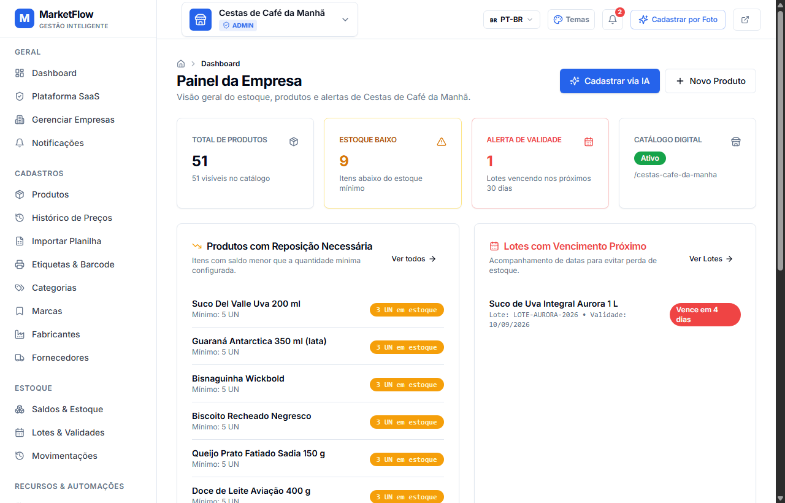
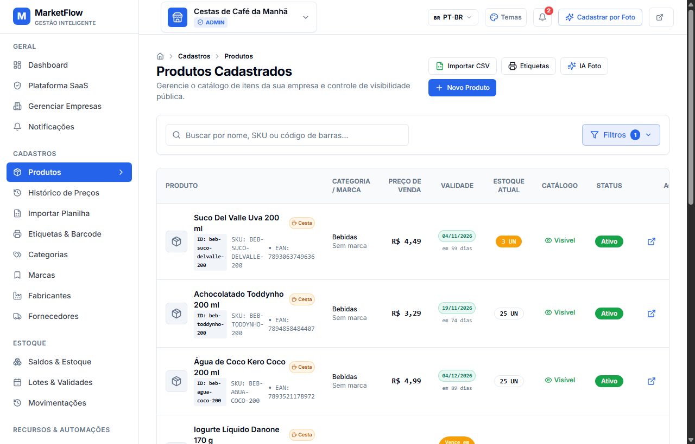
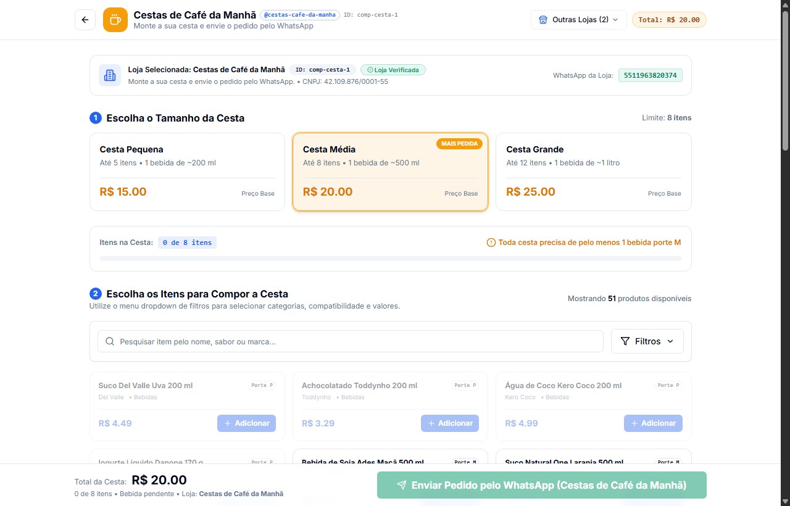
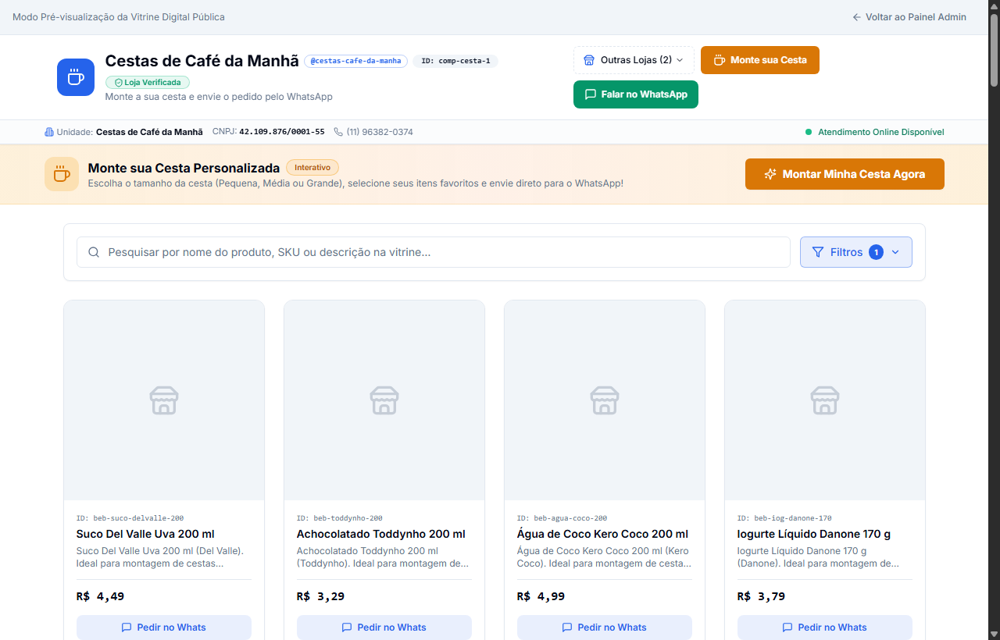
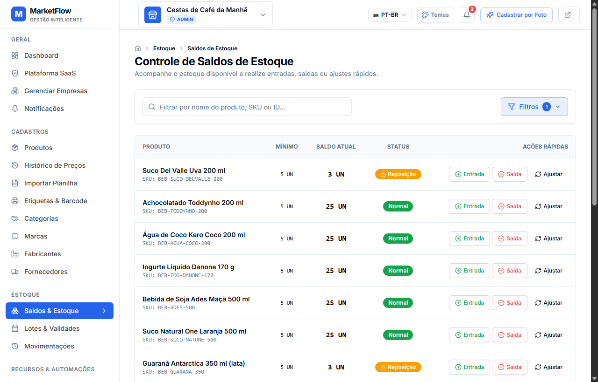
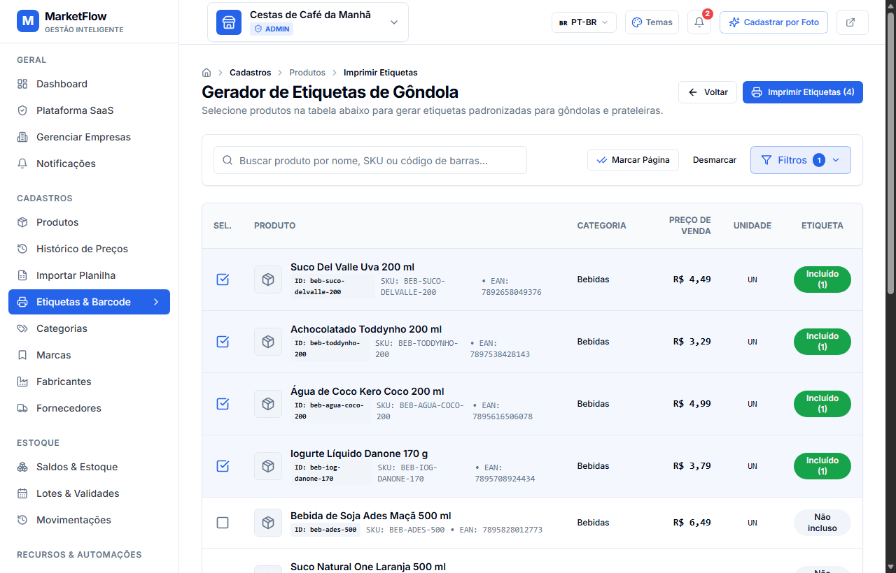

<div align="center">

# 🛒 MarketFlow

### Sistema Integrado de Gestão Comercial, Controle de Estoque & Validades, Assistente de IA e Vitrine Digital Multi-Loja

[](https://github.com/pycriador/olivelas-marketflow/actions/workflows/deploy.yml)
[](https://pycriador.github.io/olivelas-marketflow/)
[](https://react.dev/)
[](https://www.typescriptlang.org/)
[](https://tailwindcss.com/)
[](https://vitejs.dev/)
[](LICENSE)

[🌐 **Acessar Aplicação Online**](https://pycriador.github.io/olivelas-marketflow/) • [📖 **Documentação de Rotas**](#-rotas-da-aplicação) • [🛠️ **Como Executar**](#-como-executar-localmente)

</div>

---

## 📌 Sobre o Projeto

O **MarketFlow** é uma plataforma moderna e completa voltada para o varejo, comércio alimentício, empórios e negócios especializados (como lojas de cestas de café da manhã e presentes). O sistema combina um poderoso **Painel Administrativo (ERP SaaS)** para controle de produtos, estoque, lotes e validades, com uma **Vitrine Pública Digital Multi-Loja** interativa que permite aos clientes montarem seus pedidos de forma personalizada e enviarem diretamente para o WhatsApp do estabelecimento.

O frontend foi projetado como uma **Single Page Application (SPA)** de alta performance hospedada no **GitHub Pages**, com arquitetura segura onde credenciais, inteligência artificial e banco de dados residem no **Supabase**.

---

## ✨ Principais Funcionalidades

### 1. Painel de Controle & Dashboard Operacional
Visão consolidada das operações da empresa com alertas proativos para tomada de decisão rápida:
- **Indicadores Chave (KPIs)**: Total de produtos ativos, itens com estoque baixo e contagem de lotes em vencimento.
- **Alertas de Reposição**: Listagem instantânea de itens que atingiram ou estão abaixo do estoque mínimo configurado.
- **Alertas de Validade**: Acompanhamento dos produtos mais próximos da data limite de consumo para evitar perdas financeiras.

<div align="center">
  
</div>

---

### 2. Catálogo de Produtos com Validades & Filtros em Dropdown
Gestão cadastral com visão analítica e controle de perecibilidade:
- **Data de Validade Visível**: Coluna dedicada informando status com badges contextuais:
  - 🔴 **Vencido**: Destaque com contagem de dias em atraso (`Vencido (Xd)`).
  - 🟡 **Vencendo em Breve (≤ 15 dias)**: Alerta preventivo com contagem regressiva (`Vence em Xd` ou `Vence hoje`).
  - 🟢 **Dentro da Validade**: Data formatada em padrão nacional e prazo restante.
  - ⚪ **Não Perecível**: Indicação para utilitários, brindes e embalagens.
- **Filtros Avançados em Menu Dropdown**:
  - *Data de Validade*: Vencidos, Vencendo em breve, No prazo e Não perecíveis.
  - *Categorias*: Organização hierárquica com contadores dinâmicos de itens.
  - *Status*: Ativos ou inativos.
  - *Cesta de Café da Manhã*: Filtrar itens participantes ou exclusivos da cesta.
- **Paginação Dinâmica (10, 20, 30 itens)**: Seletor rápido de densidade sincronizado bidirecionalmente via URL (`?page=1&limit=10`).
- **Chips de Filtros Ativos**: Remoção individual ou limpeza global com um clique.

<div align="center">
  
</div>

---

### 3. Montagem Interativa de Cestas de Café da Manhã
Experiência do cliente na montagem da sua própria cesta de café da manhã personalizada (`/loja/:slug/cesta`):
- **Identificação da Loja**: Cabeçalho e banner de destaque exibindo Nome da Loja, ID (`company.id`), selo de **Loja Verificada**, CNPJ e canal de WhatsApp oficial.
- **Seletor Multi-Loja**: Dropdown para alternar instantaneamente entre diferentes lojas da rede cadastradas na plataforma.
- **Regras de Negócio em Tempo Real**:
  - Escolha do tamanho (Pequena - até 5 itens, Média - até 8 itens, Grande - até 12 itens).
  - Verificação de bebida obrigatória do porte compatível (P, M ou G).
  - Bloqueio inteligente contra excesso de itens no limite da cesta.
- **Menu Dropdown de Filtros**: Categorias do cardápio, compatibilidade por tamanho da cesta e faixas de preço.
- **Fechamento no WhatsApp**: Formatação automática do pedido detalhado contendo a identificação da loja, itens selecionados, porte e valor total.

<div align="center">
  
</div>

---

### 4. Vitrine Digital Multi-Loja & Deep Linking
Catálogo público da loja (`/loja/:slug`) para divulgação e atendimento:
- **Identidade da Empresa**: Avatar, identificador `@slug`, CNPJ, telefone, status de atendimento online e link para início da montagem de cesta.
- **Modal de Detalhes com URL Exclusiva**: Cada produto possui endereço único (`/loja/:slug/produto/:id`), facilitando o compartilhamento em redes sociais e campanhas.
- **Botão Direto para WhatsApp**: Inicia o atendimento com mensagem pré-formatada informando o produto consultado.

<div align="center">
  
</div>

---

### 5. Gestão de Saldos, Lotes e Movimentações de Estoque
Rastreabilidade de ponta a ponta dos estoques:
- **Controle de Saldos (`/admin/inventory`)**: Tabela completa com estoque atual, estoque reservado, valor em estoque e alerta de nível crítico.
- **Controle de Lotes (`/admin/lots`)**: Rastreio de lote do fabricante, fornecedor de origem, data de fabricação e vencimento.
- **Trilha de Auditoria (`/admin/movements`)**: Registro histórico de todas as entradas, saídas, baixas por avaria/validade e ajustes manuais.

<div align="center">
  
</div>

---

### 6. Gerador e Impressão de Etiquetas de Gôndola
Agilidade para a rotulagem de produtos físicos na loja (`/admin/products/labels`):
- Seleção individual ou seleção da página inteira com um clique.
- Contador de cópias de etiquetas por item.
- Código de barras EAN/GTIN gerado dinamicamente com preço de venda e SKU.
- Layout padronizado para impressão direta em folha A4 com grade ajustada.

<div align="center">
  
</div>

---

### 7. Assistente de Cadastro de Produtos por Foto (IA)
- Processamento de fotos de rótulos e embalagens via inteligência artificial.
- Extração automática de nome, marca, categoria sugerida, código de barras e estimativa de preço para pré-preenchimento do cadastro.

---

### 8. Personalização Visual & Internacionalização
- **20 Temas Visuais**: Seletor dinâmico de cores de destaque com alternância entre modo claro e escuro.
- **Multi-idioma**: Interface com suporte completo a Português (PT-BR), Inglês (EN) e Espanhol (ES).

---

## 🏛️ Arquitetura de Segurança & Deploy

```
┌─────────────────────────────────────────────────────────────┐
│               GITHUB PAGES (Frontend Estático)              │
│        https://pycriador.github.io/olivelas-marketflow/     │
│                                                             │
│  - SPA React 18 + Vite + Tailwind CSS                       │
│  - Suporte a rotas profundas via script 404.html            │
│  - Sincronização em localStorage com DataStore reativo      │
│  - ZERO segredos ou chaves de IA no bundle do cliente       │
└──────────────────────────────┬──────────────────────────────┘
                               │
                   Chamadas HTTPS Seguras
                               │
                               ▼
┌─────────────────────────────────────────────────────────────┐
│                  SUPABASE CLOUD / BACKEND                   │
│                                                             │
│  1. Autenticação & RLS (Row Level Security por Tenant)      │
│  2. Banco de Dados PostgreSQL & Migrações                   │
│  3. Edge Functions Isoladas (ex.: IA Multimodal)            │
│  4. Chaves secretas e segredos de ambiente blindados        │
└─────────────────────────────────────────────────────────────┘
```

---

## 🗂️ Estrutura de Pastas do Projeto

```
olivelas-marketflow/
├── .github/
│   └── workflows/
│       └── deploy.yml          # CI/CD automático no GitHub Pages
├── docs/
│   └── screenshots/            # Capturas de tela da documentação
├── public/
│   ├── 404.html                # Roteador SPA fallback para GitHub Pages
│   └── favicon.svg
├── scripts/
│   ├── capture-screenshots.mjs # Script automatizado de captura via Edge Headless
│   └── serve.mjs
├── src/
│   ├── components/
│   │   ├── layout/             # Sidebar, Header, Breadcrumbs
│   │   └── ui/                 # Botões, Badges, Inputs, DropdownFilterMenu, etc.
│   ├── context/
│   │   ├── auth-context.tsx    # Contexto de autenticação
│   │   ├── company-context.tsx # Contexto multi-empresa
│   │   └── theme-context.tsx   # Contexto de temas e idiomas
│   ├── lib/
│   │   ├── data-store.ts       # Central de persistência e auto-migração
│   │   ├── real-basket-data.ts # Dados oficiais reais do cardápio e validades
│   │   ├── supabase.ts         # Cliente Supabase
│   │   └── utils.ts            # Utilitários de moeda, datas e prazos
│   ├── pages/
│   │   ├── admin/              # Telas administrativas (Produtos, Estoque, Lotes, etc.)
│   │   └── public/             # Telas públicas (Vitrine e Montagem de Cestas)
│   ├── types/
│   │   └── index.ts            # Tipos e interfaces TypeScript do sistema
│   ├── App.tsx                 # Roteamento central e navegação
│   └── main.tsx                # Ponto de entrada React
├── package.json
├── tailwind.config.js
├── tsconfig.json
└── vite.config.ts
```

---

## 🚦 Rotas da Aplicação

### Rotas Administrativas
| Rota | Descrição |
|---|---|
| `/admin` | Dashboard operacional com alertas de reposição e validades |
| `/admin/products` | Catálogo de produtos com tabela, validade, filtros e paginação |
| `/admin/products/new` | Cadastro de novo produto com campo de validade |
| `/admin/products/labels` | Impressão e geração de etiquetas com código de barras |
| `/admin/products/import` | Importador em massa de produtos via planilha CSV |
| `/admin/categories` | Gestão de categorias em formato de tabela com paginação |
| `/admin/brands` | Gestão de marcas parceiras |
| `/admin/manufacturers` | Gestão de fabricantes industriais |
| `/admin/suppliers` | Gestão de fornecedores e distribuidores |
| `/admin/inventory` | Controle de saldos de estoque e alertas de nível mínimo |
| `/admin/lots` | Acompanhamento de lotes e controle de validade |
| `/admin/movements` | Histórico e auditoria de movimentações de estoque |
| `/admin/reports` | Relatórios de valoração, validade e divergências |
| `/admin/ai` | Cadastro assistido por foto utilizando inteligência artificial |

### Rotas Públicas
| Rota | Descrição |
|---|---|
| `/loja/:slug` | Vitrine digital da loja com identificação e produtos |
| `/loja/:slug/produto/:id` | Visualização detalhada do produto com link compartilhável |
| `/loja/:slug/cesta` | Montagem interativa da cesta de café da manhã para WhatsApp |

---

## 💻 Como Executar Localmente

### Pré-requisitos
- **Node.js** 20+ ou 24+ instalado.
- Gerenciador de pacotes **npm** ou **yarn**.

### Passo a Passo
```bash
# 1. Clone o repositório
git clone https://github.com/pycriador/olivelas-marketflow.git

# 2. Acesse o diretório do projeto
cd olivelas-marketflow

# 3. Instale as dependências
npm install

# 4. Inicie o servidor de desenvolvimento
npm run dev
```

Acesse no seu navegador: `http://localhost:5173/`

### Compilação de Produção
```bash
# Build padrão local
npm run build

# Build específico para deploy no GitHub Pages (base /olivelas-marketflow/)
npm run build:gh-pages
```

---

## 🚀 Publicação no GitHub Pages

O projeto já inclui um workflow automatizado em [`.github/workflows/deploy.yml`](.github/workflows/deploy.yml).

Para ativar o deploy no GitHub:
1. No repositório do GitHub, acesse **Settings** > **Pages**.
2. Em **Build and deployment** > **Source**, selecione **GitHub Actions**.
3. A cada `git push` na branch `main`, a compilação e publicação acontecerão automaticamente no endereço:
   👉 **https://pycriador.github.io/olivelas-marketflow/**

---

## 📄 Licença

Este projeto está sob a licença [MIT](LICENSE).

---

<div align="center">
  Desenvolvido com excelência técnica por <strong>Willian Oliveira</strong>.
</div>
