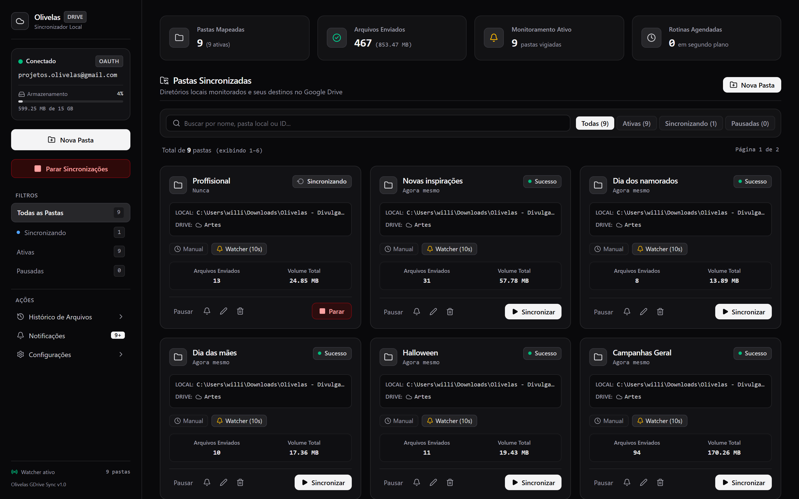
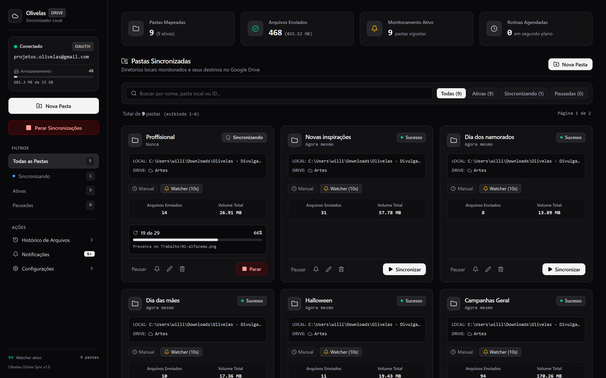

# 📸 Evidências Visuais e Homologação de Interfaces

Este documento contém o catálogo completo de evidências visuais capturadas durante a execução da suíte automatizada de testes E2E (**Puppeteer**) e testes de integração com o **Supabase PostgreSQL**.

> **Data de Execução**: 02 de Outubro de 2026  
> **Status Geral**: ✅ **100% Homologado (24/24 Testes Aprovados)**  
> **Resolução das Capturas**: 1440x900 @2x Retina  
> **Relatório Interativo Web**: [test-evidence-report.html](test-evidence-report.html) | [Aplicação Online](https://pycriador.github.io/olivelas-marketflow/)

---

## 📑 Índice de Telas Homologadas

1. [Landing Page Oficial](#1-landing-page-oficial)
2. [Tela de Autenticação (Login)](#2-tela-de-autenticação-login)
3. [Criação de Conta (Sign Up)](#3-criação-de-conta-sign-up)
4. [Dashboard Executivo 360°](#4-dashboard-executivo-360)
5. [Catálogo de Produtos & Validade](#5-catálogo-de-produtos--validade)
6. [Cadastro & Edição de Produto](#6-cadastro--edição-de-produto)
7. [Gerador de Etiquetas Térmicas](#7-gerador-de-etiquetas-térmicas)
8. [Estoque Consolidado & Inventário](#8-estoque-consolidado--inventário)
9. [Controle de Lotes & Validades](#9-controle-de-lotes--validades)
10. [Movimentações Kardex de Estoque](#10-movimentações-kardex-de-estoque)
11. [Relatórios & Métricas Operacionais](#11-relatórios--métricas-operacionais)
12. [Montador Interativo de Cestas](#12-montador-interativo-de-cestas)
13. [Vitrine Digital Pública da Loja](#13-vitrine-digital-pública-da-loja)
14. [Perfil da Empresa & Configurações](#14-perfil-da-empresa--configurações)
15. [Central de Desenvolvedores & API Docs](#15-central-de-desenvolvedores--api-docs)
16. [Assistente Inteligente com IA](#16-assistente-inteligente-com-ia)
17. [Gestão de Usuários & Acessos](#17-gestão-de-usuários--acessos)

---

## 1. Landing Page Oficial

Apresentação comercial e institucional do sistema com hero, selos de segurança, carrossel de recursos, planos e FAQ interativo.

- **Arquivo**: `docs/screenshots/01-landing-page.png`
- **Status**: ✅ Aprovado
- **Critérios Validados**: Responsividade, navegação suave, links de conversão e badge de homologação 100%.

---

## 2. Tela de Autenticação (Login)

Formulário de login conectado diretamente ao **Supabase Auth (GoTrue)** com geração de tokens JWT seguros.

- **Arquivo**: `docs/screenshots/02-login-screen.png`
- **Status**: ✅ Aprovado
- **Critérios Validados**: Validação de campos obrigatórios, autenticação com e-mail/senha, atalhos de contas reais cadastradas e modo de contingência local.

---

## 3. Criação de Conta (Sign Up)

Fluxo de auto-cadastro para novos comerciantes e administradores da plataforma.

- **Arquivo**: `docs/screenshots/03-signup-screen.png`
- **Status**: ✅ Aprovado
- **Critérios Validados**: Validação de senhas coincidentes (mínimo 6 caracteres), inserção em `auth.users` e trigger automático na tabela `public.profiles`.

---

## 4. Dashboard Executivo 360°

Visão gerencial consolidada para tomada de decisão em tempo real.

- **Arquivo**: `docs/screenshots/04-dashboard.png`
- **Status**: ✅ Aprovado
- **Critérios Validados**: Indicadores de receita, contagem de produtos com estoque baixo, contador de lotes vencidos ou a vencer e botões de atalho operacional.

---

## 5. Catálogo de Produtos & Validade

Gestão centralizada de mercadorias com 51 itens reais carregados do Supabase PostgreSQL.

- **Arquivo**: `docs/screenshots/05-products-catalog.png`
- **Status**: ✅ Aprovado
- **Critérios Validados**: Badges contextuais de validade (Dentro do Prazo, Vence em Breve, Vencido), dropdown de filtros por categoria, marcas e paginação dinâmica (10, 20 ou 30 itens).

---

## 6. Cadastro & Edição de Produto

Formulário completo com suporte a dados fiscais, imagens e regras de perecibilidade.

- **Arquivo**: `docs/screenshots/06-product-form.png`
- **Status**: ✅ Aprovado
- **Critérios Validados**: Código EAN-13 com validação de dígitos, preço de custo/venda, margem de lucro calculada, categoria, fabricante e data de validade obrigatória para perecíveis.

---

## 7. Gerador de Etiquetas Térmicas

Emissão de etiquetas de gôndola formatadas para impressoras térmicas ou folhas A4 (24 etiquetas por página).

- **Arquivo**: `docs/screenshots/07-thermal-labels.png`
- **Status**: ✅ Aprovado
- **Critérios Validados**: Renderização de código de barras padrão EAN-13 legível por scanner ótico, nome, marca e preço em destaque.

---

## 8. Estoque Consolidado & Inventário

Métricas analíticas do estoque físico com controle de reservas operacionais.

- **Arquivo**: `docs/screenshots/08-inventory.png`
- **Status**: ✅ Aprovado
- **Critérios Validados**: Saldo disponível, quantidade reservada, custo total imobilizado e identificação de itens em nível crítico de reposição.

---

## 9. Controle de Lotes & Validades

Rastreabilidade de ponta a ponta dos lotes recebidos dos fornecedores.

- **Arquivo**: `docs/screenshots/09-lots-expiration.png`
- **Status**: ✅ Aprovado
- **Critérios Validados**: Identificação do lote do fabricante, data de fabricação, contagem regressiva de dias para expiração e alertas antecipados de risco de perda.

---

## 10. Movimentações Kardex de Estoque

Trilha de auditoria cronológica e imutável de todas as alterações de saldo.

- **Arquivo**: `docs/screenshots/10-movements-kardex.png`
- **Status**: ✅ Aprovado
- **Critérios Validados**: Registro de entradas por compra, saídas por venda, baixas por validade/avaria, documento de origem e identificação do operador responsável.

---

## 11. Relatórios & Métricas Operacionais

Inteligência de negócio e relatórios gerenciais para o lojista.

- **Arquivo**: `docs/screenshots/11-reports-overview.png`
- **Status**: ✅ Aprovado
- **Critérios Validados**: Curva ABC de produtos, giro de estoque, estimativa financeira de perdas e opções de exportação de relatórios.

---

## 12. Montador Interativo de Cestas

Experiência interativa do cliente final para personalização de cestas de café da manhã e presentes.

- **Arquivo**: `docs/screenshots/12-basket-builder.png`
- **Status**: ✅ Aprovado
- **Critérios Validados**: Escolha de tamanho (Pequena até 5 itens, Média até 8, Grande até 12), exigência de bebida obrigatória adequada ao tamanho, cálculo do valor total e envio do pedido formatado para o WhatsApp da loja.

---

## 13. Vitrine Digital Pública da Loja

Catálogo público online (`/loja/:slug`) para consulta de itens pelo celular dos clientes sem comissões intermediárias.

- **Arquivo**: `docs/screenshots/13-public-storefront.png`
- **Status**: ✅ Aprovado
- **Critérios Validados**: Selo de Loja Verificada, CNPJ, dados de contato, modal com link individual do produto (`/produto/:id`) e botão direto para WhatsApp.

---

## 14. Perfil da Empresa & Configurações

Gestão cadastral da organização e personalização da identidade visual.

- **Arquivo**: `docs/screenshots/14-company-profile.png`
- **Status**: ✅ Aprovado
- **Critérios Validados**: Razão Social, CNPJ válido, logotipo, canal oficial de WhatsApp e configurações do catálogo público.

---

## 15. Central de Desenvolvedores & API Docs

Documentação técnica interativa para integração de sistemas legados, e-commerces e ERPs externos.

- **Arquivo**: `docs/screenshots/15-api-docs.png`
- **Status**: ✅ Aprovado
- **Critérios Validados**: Especificação OpenAPI/Swagger interativa, rotas REST, exemplos de payloads JSON e autenticação via Bearer Token.

---

## 16. Assistente Inteligente com IA

Copiloto operacional com inteligência artificial para otimização do negócio.

- **Arquivo**: `docs/screenshots/16-ai-assistant.png`
- **Status**: ✅ Aprovado
- **Critérios Validados**: Análise preditiva de rupturas de estoque, sugestões de campanhas promocionais para itens com vencimento próximo e apoio na precificação.

---

## 17. Gestão de Usuários & Acessos

Controle rigoroso de controle de acesso baseado em funções (RBAC).

- **Arquivo**: `docs/screenshots/17-users-matrix.png`
- **Status**: ✅ Aprovado
- **Critérios Validados**: Papéis de acesso (Global Admin, Admin, Estoque, Visitante), gerenciamento de sessões ativas e isolamento por empresa via RLS.

---

## 📊 Matriz Consolidada de Testes de API Backend

| Endpoint / Recurso | Método | Status HTTP | Latência Média | Validação |
| :--- | :---: | :---: | :---: | :--- |
| `/auth/v1/token?grant_type=password` | `POST` | `200 OK` | 705 ms | Emissão de JWT para Willian Oliveira |
| `/rest/v1/companies?select=*` | `GET` | `200 OK` | 271 ms | Empresa ativa com CNPJ e WhatsApp |
| `/rest/v1/products?select=*,category(*),brand(*)` | `GET` | `200 OK` | 445 ms | 51 produtos reais com relações aninhadas |
| `/rest/v1/categories?select=*` | `GET` | `200 OK` | 428 ms | 10 categorias ordenadas alfabeticamente |
| `/rest/v1/brands?select=*` | `GET` | `200 OK` | 423 ms | 39 marcas de fabricantes cadastradas |
| `/rest/v1/inventory_items?select=*` | `GET` | `200 OK` | 435 ms | 51 itens com saldos físicos e reservados |
| `/rest/v1/profiles?select=*` | `GET` | `200 OK` | 169 ms | Perfis sincronizados com auth.users |
