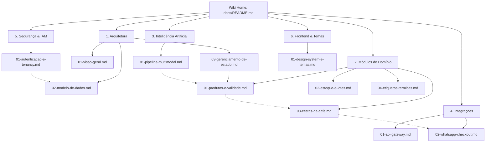

# 📚 MarketFlow Knowledge Wiki — Documentação Oficial do Sistema

Bem-vindo à **Wiki Técnica e de Arquitetura do Olivelas MarketFlow**. Esta base de conhecimento foi projetada de forma modular, navegável e exaustiva para permitir que desenvolvedores, arquitetos de software e sistemas de IA compreendam e operem todos os subsistemas do projeto.

---

## 🗺️ Mapa Navegável da Wiki

A documentação está dividida em 6 pilares temáticos. Utilize os links abaixo para navegar entre os módulos:

### 🏛️ 1. Arquitetura e Engenharia de Base
- [01. Visão Geral da Arquitetura](architecture/01-visao-geral.md) — Topologia global, filosofia Offline-First e o segredo do SPA Routing no GitHub Pages.
- [02. Modelo Relacional de Dados](architecture/02-modelo-de-dados.md) — Esquema PostgreSQL (Supabase), convenção de IDs semânticos e políticas de Row Level Security (RLS).
- [03. Gerenciamento de Estado e Sincronização](architecture/03-gerenciamento-de-estado.md) — O Singleton Cache-First `DataStore`, CustomEvents reativos e background sync.

### 📦 2. Módulos de Domínio e Operações
- [01. Gestão de Produtos e Controle de Validade](modules/01-produtos-e-validade.md) — Catálogo, sistema tricolor de perecibilidade, shelf-life preditivo e paginação/filtros.
- [02. Controle de Estoque, Lotes e Kardex](modules/02-estoque-e-lotes.md) — Rastreabilidade sanitária de lotes (`lots`), movimentações e saldos consolidados.
- [03. Motor de Cestas de Café da Manhã](modules/03-cestas-de-cafe.md) — Montagem paramétrica de kits (P/M/G), travas de bebidas por volumetria e despacho estruturado.
- [04. Motor de Etiquetas Térmicas de Gôndola](modules/04-etiquetas-termicas.md) — Impressão de gôndola via CSS Print, layout compacto e simulação de código de barras.

### 🧠 3. Inteligência Artificial e Visão Computacional
- [01. Pipeline Multimodal de IA](ai/01-pipeline-multimodal.md) — Análise fotográfica de produtos, detecção de lacunas em gôndolas, Edge Functions e fallback resiliente.

### 🔌 4. Integrações e Developer Ecosystem
- [01. In-Browser API Gateway e OpenAPI 3.0](integrations/01-api-gateway.md) — Emulação de gateway REST, tokens com hash SHA-256 de prefixo, Rate Limiting e Swagger.
- [02. Checkout e Despacho via WhatsApp](integrations/02-whatsapp-checkout.md) — Deep link internacional, comanda formatada em Markdown e gravação do intent de compra.

### 🛡️ 5. Segurança, Governança e Multi-Tenancy
- [01. Autenticação, IAM e Isolamento de Tenants](security/01-autenticacao-e-tenancy.md) — Supabase Auth, RBAC (`app_role`), profiles e isolamento por empresa.

### 🎨 6. Interface, Design System e Internacionalização
- [01. Design System, 20 Temas Dinâmicos e i18n](frontend/01-design-system-e-temas.md) — Injeção de variáveis CSS, suporte Dark/Light e dicionários em PT-BR, EN e ES.

---

## 🧭 Diagrama de Interconectividade da Wiki

---

## 📌 Diretrizes de Leitura e Convenções

1. **Evite Duplicação de Conceitos:** Cada documento trata exclusivamente do seu escopo funcional e referencia os demais através de links relativos navegáveis.
2. **IDs Semânticos:** O sistema utiliza slugs alfanuméricos (`comp-cesta-1`, `beb-suco-delvalle-200`) em vez de UUIDs arbitrários para facilitar leitura física e interoperabilidade.
3. **Resiliência Offline:** Qualquer operação na plataforma é executada primeiro localmente (`localStorage`) e propagada em segundo plano para a nuvem.
