# ARQUITETURA CANÔNICA E BLUEPRINT DE RECONSTRUÇÃO TOTAL DO SISTEMA
## PROJETO: OLIVELAS MARKETFLOW — SISTEMA MULTI-TENANT DE GESTÃO INTELIGENTE DE ESTOQUE, VALIDADE, IA MULTIMODAL E CATÁLOGO PÚBLICO

> **CLASSIFICAÇÃO TÉCNICA:** DOCUMENTO DE ENGENHARIA REVERSA EXAUSTIVA  
> **OBJETIVO DESTE DOCUMENTO:** Preservar 100% do conhecimento implícito e explícito de engenharia do sistema, permitindo que uma Inteligência Artificial ou um Engenheiro de Software Sênior reconstrua cada linha de código, esquema de banco de dados, roteamento e regra de domínio do zero, mesmo que todos os arquivos fontes originais sejam destruídos.

---

## 1. IDENTIDADE DO SISTEMA E DNA ARQUITETURAL

### 1.1 Objetivo e Domínio de Negócio
O **Olivelas MarketFlow** é um sistema **Multi-Tenant (SaaS)** desenhado para automação operacional de micro e pequenos varejistas, mercados de vizinhança, lojas de conveniência e operações especializadas (com destaque para montagem e venda personalizada de **Cestas de Café da Manhã**).

O sistema resolve quatro dores críticas do varejo físico e híbrido:
1. **Controle Estrito de Validade e Perecíveis:** Rastreabilidade por lotes (`lots`), alerta visual tricolor de vencimento em 3 tiers (Normal, Atenção ≤ 15 dias, Vencido) e cálculo preditivo de shelf-life por categoria alimentícia.
2. **Motor de Montagem de Kits/Cestas com Restrições:** Configuração paramétrica de cestas (Pequena, Média, Grande), com travas rígidas de bebidas por tier de volumetria (~200ml, ~500ml, ~1L), checkout direto com despacho via WhatsApp e integração assíncrona de pedidos.
3. **Visão Computacional e IA Multimodal no Varejo:** Análise fotográfica de produtos e prateleiras (estimativa de estoque, lacunas de gôndola, extração OCR de códigos de barras e datas de validade) integrada via Supabase Edge Functions com fallback resiliente para modelos locais e heurísticas determinísticas.
4. **API Gateway & Developer Ecosystem no Navegador:** Sistema de chaves de API (`mf_live_...` / `mf_test_...`) com autenticação com hash SHA-256 de prefixo, documentação Swagger/OpenAPI 3.0 interativa, rate limiting de 60 req/min e monitor de auditoria de chamadas em tempo real.

---

### 1.2 Stack Tecnológico Rigoroso

| Camada | Tecnologia Adotada | Versão Exata | Motivo Arquitetural e Rationale |
| :--- | :--- | :--- | :--- |
| **Runtime & Core** | React | `^18.3.1` | Compatibilidade com ecossistema headless Radix UI e renderização concorrente. |
| **Linguagem** | TypeScript | `^5.5.3` | Tipagem estrita com compilação sem erro (`strict: true`, `noEmit` verificado). |
| **Build Tool & Bundler** | Vite | `^5.4.3` | HMR sub-segundo e configuração customizável de `base` para publicação em subpastas. |
| **Estilização & UI Engine**| Tailwind CSS | `^3.4.11` | Estilização orientada a tokens, suporte a 20 temas dinâmicos via classes CSS e modo escuro. |
| **Componentes Base** | Radix UI (Primitivos) | `^1.1.x` | Acessibilidade WAI-ARIA nativa, modais, dropdowns, tooltips e popovers desprovidos de estilo. |
| **Ícones** | Lucide React | `^0.440.0` | Conjunto leve de SVGs consistentes para varejo e ERP. |
| **BaaS / Banco de Dados** | Supabase (PostgreSQL 15) | `@supabase/supabase-js ^2.45.0` | RLS (Row Level Security), Auth nativo, Edge Functions Deno e PostgREST em tempo real. |
| **Arquitetura de Estado** | Hybrid Cache-First (`DataStore`) | Proprietário | Persistência síncrona em `localStorage`, broadcast via `CustomEvent` e push assíncrono para Supabase. |
| **Roteamento SPA** | Vanilla History Router | Proprietário | Roteador customizado sem dependência do `react-router-dom`, contornando limitações do GitHub Pages. |

---

## 2. TOPOLOGIA DO SISTEMA E GRAFO DE INTERDEPENDÊNCIAS

### 2.1 Grafo Geral de Módulos (Mermaid)

```mermaid
graph TD
    subgraph Cliente_Navegador ["Navegador / Cliente SPA"]
        GH_SPA["404.html & index.html (SPA Rewrite Handler)"]
        RouterApp["App.tsx (History State Router)"]
        
        subgraph Contextos ["Camada de Contextos Reativos"]
            AuthCtx["AuthContext (Supabase + Demo Fallback)"]
            ThemeCtx["ThemeContext (20 Temas / Dark Mode)"]
            CompCtx["CompanyContext (Multi-Tenant Selector)"]
        end

        subgraph Estado_Local ["Motor de Persistência Híbrida"]
            DStore["DataStore Singleton (Cache-First)"]
            EventBus["CustomEvent: marketflow_datastore_change"]
            LocalStorage["localStorage (offline cache)"]
        end

        subgraph Motores_Dominio ["Motores de Domínio"]
            BasketEngine["Motor de Cestas & WhatsApp (real-basket-data.ts)"]
            ThermalEngine["Motor de Etiquetas Térmicas (product-labels.tsx)"]
            AIEngine["Pipeline Multimodal de IA (ai-service.ts)"]
            ApiGateway["API Gateway Emulado & OpenAPI (router.ts)"]
        end

        subgraph Telas_Admin ["Área Administrativa (/admin)"]
            AdmDash["Dashboard Operacional"]
            AdmProd["Gestão de Produtos & Validade"]
            AdmInv["Inventário & Movimentações (Kardex)"]
            AdmLots["Rastreabilidade de Lotes"]
            AdmComp["Gerenciamento de Empresas"]
            AdmUsers["Gestão de Usuários & Papéis"]
            AdmLabels["Impressão de Etiquetas"]
            AdmAPI["Portal do Desenvolvedor & Swagger"]
        end

        subgraph Loja_Publica ["Loja Pública (/loja/:slug)"]
            PubStore["Catálogo de Produtos & Filtros"]
            PubBasket["Montador Interativo de Cestas (P/M/G)"]
            PubDetail["Detalhe do Produto"]
        end
    end

    subgraph Backend_Supabase ["Supabase Cloud / PostgreSQL"]
        PostgREST["PostgREST REST API"]
        PostgresTables["Tabelas Relacionais (companies, products, etc.)"]
        RLS["Row Level Security Policies"]
        EdgeFunc["Edge Functions (ai-analyze)"]
    end

    %% Ligações
    GH_SPA --> RouterApp
    RouterApp --> AuthCtx
    RouterApp --> ThemeCtx
    RouterApp --> CompCtx
    
    AuthCtx --> DStore
    CompCtx --> DStore
    
    DStore <--> LocalStorage
    DStore --> EventBus
    EventBus --> AdmProd
    EventBus --> AdmInv
    EventBus --> PubStore

    DStore -.->|Sincronização Assíncrona / SyncWithRemote| PostgREST
    PostgREST --> PostgresTables
    PostgresTables --- RLS

    AIEngine -.->|Invocação Segura| EdgeFunc
    AIEngine -.->|Fallback Local Heurístico| DStore

    RouterApp --> Telas_Admin
    RouterApp --> Loja_Publica
```



---

### 2.2 O Segredo do Roteamento SPA no GitHub Pages (Single-Page Bypass Hack)

#### O Problema Crítico de Hospedagem Estática
Servidores estáticos tradicionais como GitHub Pages procuram arquivos literais correspondentes ao caminho da requisição. Se um usuário acessar diretamente `https://dominio.com/olivelas-marketflow/admin/products`, o servidor retornará **HTTP 404 Not Found**, pois não existe o arquivo físico `admin/products.html`.

#### A Solução Arquitetural de 2 Passos
O sistema implementa o padrão industrial **SPA GitHub Pages Redirect**:

1. **Captura no `public/404.html`:**
   Ao receber o 404, o GitHub Pages serve `public/404.html`. O script inline captura o caminho requisitado, converte as barras em parâmetros de consulta codificados (`/?/admin/products`) e executa um `window.location.replace`:
   ```javascript
   var pathSegmentsToKeep = 1; // 1 devido ao path base /olivelas-marketflow/
   var l = window.location;
   l.replace(
     l.protocol + '//' + l.hostname + (l.port ? ':' + l.port : '') +
     l.pathname.split('/').slice(0, 1 + pathSegmentsToKeep).join('/') + '/?/' +
     l.pathname.slice(1).split('/').slice(pathSegmentsToKeep).join('/').replace(/&/g, '~and~') +
     (l.search ? '&' + l.search.slice(1).replace(/&/g, '~and~') : '') +
     l.hash
   );
   ```

2. **Restauração Transparente no `<head>` do `index.html`:**
   Antes que qualquer script React ou Vite execute, o script no `<head>` do `index.html` decodifica a URL e restaura a rota correta na árvore de histórico com `replaceState`:
   ```javascript
   (function(l) {
     if (l.search[1] === '/' ) {
       var decoded = l.search.slice(1).split('&').map(function(s) { 
         return s.replace(/~and~/g, '&')
       }).join('?');
       window.history.replaceState(null, null,
           l.pathname.slice(0, -1) + decoded + l.hash
       );
     }
   }(window.location))
   ```

3. **Roteador Próprio em `src/App.tsx`:**
   Em vez de instanciar `react-router-dom` (que causa inconsistências com subdiretórios no GitHub Pages), o `App.tsx` mantém a rota ativa através de um estado React e escuta o evento global `popstate`:
   ```typescript
   const getInitialPath = () => {
     const path = window.location.pathname;
     const prefix = '/olivelas-marketflow';
     return path.startsWith(prefix) ? path.substring(prefix.length) || '/' : path || '/';
   };
   ```

---

## 3. ESQUEMA RELACIONAL CANÔNICO E REGRAS POSTGREST

O banco de dados relacional oficial está hospedado no PostgreSQL do Supabase. Todos os registros utilizam convenção de **IDs Semânticos de Texto** (`id TEXT PRIMARY KEY`), garantindo interoperabilidade com scanners de código de barras, exportações JSON e chaves de cache locais sem tabelas de mapeamento intermediárias.

### 3.1 DDL Canônica Completa das Tabelas

```sql
-- Extensões e Tipos
CREATE EXTENSION IF NOT EXISTS "uuid-ossp";

CREATE TYPE public.app_role AS ENUM ('global_admin', 'admin', 'stock', 'visitor');

-- 1. Perfis de Usuário (vinculados ao auth.users do Supabase)
CREATE TABLE public.profiles (
  id UUID PRIMARY KEY REFERENCES auth.users(id) ON DELETE CASCADE,
  full_name VARCHAR(150) NOT NULL,
  avatar_url TEXT,
  phone VARCHAR(30),
  created_at TIMESTAMPTZ NOT NULL DEFAULT now(),
  updated_at TIMESTAMPTZ NOT NULL DEFAULT now()
);

-- 2. Tenants / Empresas
CREATE TABLE public.companies (
  id TEXT PRIMARY KEY,
  name VARCHAR(150) NOT NULL,
  legal_name VARCHAR(200),
  cnpj VARCHAR(30),
  slug VARCHAR(100) NOT NULL UNIQUE,
  email VARCHAR(255),
  phone VARCHAR(30),
  whatsapp VARCHAR(30),
  logo_url TEXT,
  description TEXT,
  subtitulo TEXT,
  moeda VARCHAR(10) DEFAULT 'BRL',
  avisoRodape TEXT,
  breakfast_basket_enabled BOOLEAN NOT NULL DEFAULT true,
  active BOOLEAN NOT NULL DEFAULT true,
  created_by UUID REFERENCES public.profiles(id) ON DELETE SET NULL,
  created_at TIMESTAMPTZ NOT NULL DEFAULT now(),
  updated_at TIMESTAMPTZ NOT NULL DEFAULT now(),
  deleted_at TIMESTAMPTZ
);

-- 3. Membresia de Usuários nas Empresas
CREATE TABLE public.company_users (
  id TEXT PRIMARY KEY DEFAULT gen_random_uuid()::text,
  company_id TEXT NOT NULL REFERENCES public.companies(id) ON DELETE CASCADE,
  user_id UUID NOT NULL REFERENCES public.profiles(id) ON DELETE CASCADE,
  role public.app_role NOT NULL DEFAULT 'admin',
  active BOOLEAN NOT NULL DEFAULT true,
  created_at TIMESTAMPTZ NOT NULL DEFAULT now(),
  updated_at TIMESTAMPTZ NOT NULL DEFAULT now(),
  CONSTRAINT unique_company_user UNIQUE(company_id, user_id)
);

-- 4. Categorias de Produtos
CREATE TABLE public.categories (
  id TEXT PRIMARY KEY,
  company_id TEXT NOT NULL REFERENCES public.companies(id) ON DELETE CASCADE,
  name VARCHAR(100) NOT NULL,
  description TEXT,
  parent_id TEXT REFERENCES public.categories(id) ON DELETE SET NULL,
  image_url TEXT,
  active BOOLEAN NOT NULL DEFAULT true,
  created_at TIMESTAMPTZ NOT NULL DEFAULT now(),
  updated_at TIMESTAMPTZ NOT NULL DEFAULT now(),
  deleted_at TIMESTAMPTZ
);

-- 5. Fabricantes e Marcas
CREATE TABLE public.manufacturers (
  id TEXT PRIMARY KEY,
  company_id TEXT NOT NULL REFERENCES public.companies(id) ON DELETE CASCADE,
  name VARCHAR(150) NOT NULL,
  document VARCHAR(30),
  phone VARCHAR(30),
  email VARCHAR(255),
  address TEXT,
  notes TEXT,
  active BOOLEAN NOT NULL DEFAULT true,
  created_at TIMESTAMPTZ NOT NULL DEFAULT now(),
  updated_at TIMESTAMPTZ NOT NULL DEFAULT now(),
  deleted_at TIMESTAMPTZ
);

CREATE TABLE public.brands (
  id TEXT PRIMARY KEY,
  company_id TEXT NOT NULL REFERENCES public.companies(id) ON DELETE CASCADE,
  name VARCHAR(100) NOT NULL,
  description TEXT,
  logo_url TEXT,
  active BOOLEAN NOT NULL DEFAULT true,
  created_at TIMESTAMPTZ NOT NULL DEFAULT now(),
  updated_at TIMESTAMPTZ NOT NULL DEFAULT now(),
  deleted_at TIMESTAMPTZ
);

-- 6. Fornecedores
CREATE TABLE public.suppliers (
  id TEXT PRIMARY KEY,
  company_id TEXT NOT NULL REFERENCES public.companies(id) ON DELETE CASCADE,
  name VARCHAR(150) NOT NULL,
  legal_name VARCHAR(200),
  cnpj VARCHAR(30),
  email VARCHAR(255),
  phone VARCHAR(30),
  whatsapp VARCHAR(30),
  address TEXT,
  notes TEXT,
  active BOOLEAN NOT NULL DEFAULT true,
  created_at TIMESTAMPTZ NOT NULL DEFAULT now(),
  updated_at TIMESTAMPTZ NOT NULL DEFAULT now(),
  deleted_at TIMESTAMPTZ
);

-- 7. Produtos (com Data de Validade e Atributos de Cesta)
CREATE TABLE public.products (
  id TEXT PRIMARY KEY,
  company_id TEXT NOT NULL REFERENCES public.companies(id) ON DELETE CASCADE,
  category_id TEXT REFERENCES public.categories(id) ON DELETE SET NULL,
  brand_id TEXT REFERENCES public.brands(id) ON DELETE SET NULL,
  supplier_id TEXT REFERENCES public.suppliers(id) ON DELETE SET NULL,
  manufacturer_id TEXT REFERENCES public.manufacturers(id) ON DELETE SET NULL,
  name VARCHAR(200) NOT NULL,
  description TEXT,
  sku VARCHAR(50),
  barcode VARCHAR(50),
  unit VARCHAR(20) NOT NULL DEFAULT 'UN',
  cost_price NUMERIC(10,2) NOT NULL DEFAULT 0.00,
  sale_price NUMERIC(10,2) NOT NULL DEFAULT 0.00,
  minimum_stock INTEGER NOT NULL DEFAULT 0,
  maximum_stock INTEGER NOT NULL DEFAULT 0,
  expiration_date DATE,
  active BOOLEAN NOT NULL DEFAULT true,
  catalog_visible BOOLEAN NOT NULL DEFAULT true,
  show_price BOOLEAN NOT NULL DEFAULT true,
  allow_contact BOOLEAN NOT NULL DEFAULT true,
  active_in_basket BOOLEAN NOT NULL DEFAULT true,
  basket_sizes JSONB,               -- Ex: ["pequena", "media", "grande"]
  drink_tier VARCHAR(10),           -- Ex: 'P', 'M', 'G' ou NULL
  image_url TEXT,
  created_at TIMESTAMPTZ NOT NULL DEFAULT now(),
  updated_at TIMESTAMPTZ NOT NULL DEFAULT now(),
  deleted_at TIMESTAMPTZ
);

-- 8. Estoque Físico Consolidado
CREATE TABLE public.inventory_items (
  id TEXT PRIMARY KEY,
  company_id TEXT NOT NULL REFERENCES public.companies(id) ON DELETE CASCADE,
  product_id TEXT NOT NULL REFERENCES public.products(id) ON DELETE CASCADE,
  quantity INTEGER NOT NULL DEFAULT 0,
  reserved_quantity INTEGER NOT NULL DEFAULT 0,
  location VARCHAR(100),
  created_at TIMESTAMPTZ NOT NULL DEFAULT now(),
  updated_at TIMESTAMPTZ NOT NULL DEFAULT now(),
  CONSTRAINT unique_product_inventory UNIQUE (company_id, product_id)
);

-- 9. Lotes com Data de Validade Específica
CREATE TABLE public.lots (
  id TEXT PRIMARY KEY,
  company_id TEXT NOT NULL REFERENCES public.companies(id) ON DELETE CASCADE,
  product_id TEXT NOT NULL REFERENCES public.products(id) ON DELETE CASCADE,
  lot_number VARCHAR(100) NOT NULL,
  initial_quantity INTEGER NOT NULL DEFAULT 0,
  current_quantity INTEGER NOT NULL DEFAULT 0,
  manufacturing_date DATE,
  expiration_date DATE NOT NULL,
  cost_price NUMERIC(10,2) NOT NULL DEFAULT 0.00,
  status VARCHAR(30) NOT NULL DEFAULT 'active',
  created_at TIMESTAMPTZ NOT NULL DEFAULT now(),
  updated_at TIMESTAMPTZ NOT NULL DEFAULT now()
);

-- 10. Kardex / Movimentações de Estoque
CREATE TABLE public.inventory_movements (
  id TEXT PRIMARY KEY DEFAULT gen_random_uuid()::text,
  company_id TEXT NOT NULL REFERENCES public.companies(id) ON DELETE CASCADE,
  product_id TEXT NOT NULL REFERENCES public.products(id) ON DELETE CASCADE,
  lot_id TEXT REFERENCES public.lots(id) ON DELETE SET NULL,
  type VARCHAR(30) NOT NULL, -- 'in', 'out', 'transfer', 'adjustment', 'loss'
  quantity INTEGER NOT NULL,
  previous_quantity INTEGER NOT NULL DEFAULT 0,
  new_quantity INTEGER NOT NULL DEFAULT 0,
  reason TEXT,
  document_reference VARCHAR(100),
  performed_by UUID REFERENCES public.profiles(id) ON DELETE SET NULL,
  created_at TIMESTAMPTZ NOT NULL DEFAULT now()
);

-- 11. Pedidos do Catálogo Público / Checkout WhatsApp
CREATE TABLE public.catalog_requests (
  id TEXT PRIMARY KEY DEFAULT gen_random_uuid()::text,
  company_id TEXT NOT NULL REFERENCES public.companies(id) ON DELETE CASCADE,
  customer_name VARCHAR(150) NOT NULL,
  customer_phone VARCHAR(30) NOT NULL,
  customer_email VARCHAR(255),
  total_amount NUMERIC(10,2) NOT NULL DEFAULT 0.00,
  items JSONB NOT NULL DEFAULT '[]'::jsonb,
  delivery_address TEXT,
  gift_message TEXT,
  status VARCHAR(30) NOT NULL DEFAULT 'pending',
  source VARCHAR(50) DEFAULT 'whatsapp_catalog',
  created_at TIMESTAMPTZ NOT NULL DEFAULT now(),
  updated_at TIMESTAMPTZ NOT NULL DEFAULT now()
);
```

---

### 3.2 Gatilhos (Triggers) e Segurança RLS (Row Level Security)

1. **Trigger de Criação Automática de Perfil (`handle_new_user`):**
   Garante que todo registro efetuado no `auth.users` do Supabase gere imediatamente uma linha correspondente em `public.profiles`, herdando metadados de nome e avatar.
   ```sql
   CREATE OR REPLACE FUNCTION public.handle_new_user()
   RETURNS TRIGGER AS $$
   BEGIN
     INSERT INTO public.profiles (id, full_name, avatar_url, phone)
     VALUES (
       new.id,
       COALESCE(new.raw_user_meta_data->>'full_name', split_part(new.email, '@', 1)),
       new.raw_user_meta_data->>'avatar_url',
       new.raw_user_meta_data->>'phone'
     )
     ON CONFLICT (id) DO UPDATE
     SET full_name = EXCLUDED.full_name,
         updated_at = now();
     RETURN new;
   END;
   $$ LANGUAGE plpgsql SECURITY DEFINER;
   ```

2. **Políticas de Acesso RLS:**
   - **Leitura Pública de Lojas e Catálogo:** Qualquer visitante não autenticado pode consultar empresas ativas (`active = true`), categorias, produtos visíveis e marcas, permitindo que a Loja Pública funcione livremente.
   - **Inserção Aberta de Pedidos:** A tabela `catalog_requests` aceita `INSERT WITH CHECK (true)` para que os clientes da loja pública registrem o intent de compra antes do redirecionamento ao WhatsApp.
   - **Isolamento de Escrita:** Modificações nas tabelas de inventário e produtos exigem usuário autenticado (`TO authenticated`) vinculado à empresa correspondente em `company_users`.

---

## 4. CAMADA DE ESTADO E PERSISTÊNCIA HÍBRIDA (`DataStore`)

### 4.1 O Padrão Singleton Cache-First com Sincronização Reativa
A classe central de persistência é o `DataStore` (`src/lib/data-store.ts`).

#### Mecânica Operacional:
1. **Leitura Instantânea (Zero Latency):**
   `dataStore.getProducts(companyId)` lê os dados diretamente do `localStorage`. Não há spinners ou travamentos de interface no carregamento inicial.
2. **Mutação Otimista & Broadcast Local:**
   Ao salvar um produto (`dataStore.saveProduct(prod)`):
   - Atualiza o array no `localStorage`.
   - Dispara imediatamente um `window.dispatchEvent(new CustomEvent('marketflow_datastore_change', { detail: { key } }))`.
   - Todos os componentes React da interface escutam esse evento e atualizam seu estado local via `useState`.
3. **Escrita em Segundo Plano (Background Push):**
   Imediatamente após gravar no storage local, o `DataStore` chama assincronamente o serviço do Supabase correspondente (`productsService.createProduct(prod)` ou `updateProduct(prod)`), com captura e log de eventuais erros sem bloquear a UI.
4. **Sincronização Remota no Boot (`syncWithRemote`):**
   Quando a aplicação inicia, o método `dataStore.syncWithRemote()` é invocado em background. Ele realiza `Promise.all` em todos os endpoints PostgREST do Supabase e substitui suavemente as chaves do `localStorage` com os dados canônicos da nuvem.

---

## 5. MOTORES DE DOMÍNIO E REGRAS DE NEGÓCIO

### 5.1 Motor de Cestas de Café da Manhã (`real-basket-data.ts`)

O módulo de cestas possui 3 tamanhos bem delimitados com regras estritas:

| Tamanho | Preço Base | Limite Máximo de Itens | Restrição Obrigatória de Bebida | Resumo Apresentado |
| :--- | :--- | :--- | :--- | :--- |
| **Pequena** | R$ 15,00 | Até 5 itens | 1 Bebida de Tier "P" (~200ml) | Até 5 itens • 1 bebida de ~200 ml |
| **Média** (Destaque) | R$ 20,00 | Até 8 itens | 1 Bebida de Tier "M" (~500ml) | Até 8 itens • 1 bebida de ~500 ml |
| **Grande** | R$ 25,00 | Até 12 itens | 1 Bebida de Tier "G" (~1 Litro) | Até 12 itens • 1 bebida de ~1 litro |

#### Regras de Validação do Checkout:
1. Uma cesta **não pode ser finalizada** se a contagem de itens exceder o `maxItens` do tamanho escolhido.
2. É obrigatória a seleção de **pelo menos 1 bebida** correspondente ao `drink_tier` do tamanho (`P` para pequena, `M` para média, `G` para grande).
3. O valor total do pedido é computado pela fórmula:
   Preço Final = Preço Base da Cesta + Soma(Preço Unitário do Item * Quantidade)
4. **Despacho via WhatsApp:**
   A mensagem enviada ao lojista é formatada automaticamente no formato de comanda:
   ```text
   *Novo Pedido de Cesta - Cestas de Café da Manhã*
   -----------------------------------
   Tamanho: Cesta Média (R$ 20,00)
   
   Itens Escolhidos:
   - 1x Suco Natural One Laranja 500 ml (R$ 10,90)
   - 1x Pão de Queijo Forno de Minas (R$ 16,90)
   - 1x Presunto Seara Fatiado 200g (R$ 8,90)
   
   *Total do Pedido: R$ 56,70*
   Cliente: Roberto Silva
   Telefone: (11) 96382-0374
   ```

---

### 5.2 Motor de Validade e Alertas Preditivos

O sistema categoriza itens perecíveis em 3 faixas de criticidade:
1. **Crítico / Vencido:** `diasRestantes < 0` -> Badge Vermelho `destructive` exibindo os dias em atraso.
2. **Alerta / Vencendo Logo:** `0 <= diasRestantes <= 15` -> Badge Âmbar `warning` exibindo contagem regressiva ("Vence hoje" ou "Vence em Xd").
3. **Regular:** `diasRestantes > 15` -> Badge Verde `emerald` com a data formatada.

#### Cálculo de Shelf-life Preditivo por Categoria:
No cadastro de novos produtos, se a data de validade não for fornecida manualmente, a função `getRealExpirationDate` aplica uma heurística de vida útil conforme a categoria biológica do produto:
- **Frutas Frescas:** 3 a 7 dias.
- **Frios e Queijos Fatiados:** 5 a 15 dias.
- **Padaria Artesanal (Croissants, Roscas):** 3 a 5 dias.
- **Panificação Industrial (Pullman, Wickbold):** 14 a 18 dias.
- **Laticínios Líquidos:** 7 a 14 dias.
- **Sucos e Refrigerantes UHT:** 45 a 120 dias.
- **Biscoitos e Mercearia Seca:** 90 a 150 dias.
- **Doces e Geleias Lacradas:** 180 a 365 dias.
- **Canecas e Embalagens:** Não perecível (`undefined`).

---

### 5.3 Motor de Etiquetas Térmicas para Gôndola (`product-labels.tsx`)

O módulo de impressão de etiquetas emite gabaritos de etiquetas de gôndola formatados em CSS Print (`@media print`):
- **Dimensões e Grade:** Grade flexível de 3 ou 4 colunas em folha A4 com quebra de página automática (`break-inside-avoid`).
- **Composição da Etiqueta:**
  - Nome do Tenant / Loja em caixa alta no cabeçalho.
  - Título do produto com limite de 2 linhas (`line-clamp-2`).
  - Preço de venda em destaque tipográfico com números grandes (moeda BRL com vírgula).
  - Código de barras visual simulado com ícone SVG e chave legível do EAN/SKU.
  - Unidade de medida oficial (`UN`, `KG`, `CX`).

---

### 5.4 Pipeline Multimodal de IA com Visão Computacional (`ai-service.ts`)

O serviço `AIService` é estruturado sobre o padrão de projeto **Adapter**:
1. **Supabase Edge Function (`ai-analyze`):**
   Tenta invocar a Edge Function no backend enviando o payload `{ imageUrl, provider }`. Assegura que chaves de API secretas (OpenAI ou Gemini) jamais vazem para o bundle do cliente.
2. **Fallback Heurístico Local (`MockAIAdapter`):**
   Se o backend estiver offline ou sem credenciais, a camada local processa a imagem com um delay realista de 600ms e gera:
   - Nome comercial sugerido, preço de venda recomendado com margem padrão (65% sobre custo), código de barras formatado e score de confiança.
3. **Score de Confiança e Human-in-the-Loop:**
   Se `confidence_score < 0.85`, a flag `requires_human_review: true` é atribuída, acionando uma badge de confirmação manual na interface do operador.
4. **Log de Consumo e Auditoria:**
   Todo processamento gera um registro em `marketflow_ai_jobs` e computa o gasto estimado em dólares (`costUsd`), input tokens e output tokens.

---

### 5.5 API Gateway Emulado em Navegador & Swagger OpenAPI 3.0 (`router.ts`)

Para permitir que desenvolvedores externos integrem seus ERPs ao MarketFlow diretamente no navegador:
1. **Formato das Chaves de Acesso:**
   - Produção: `mf_live_[24 caracteres alfanuméricos]`
   - Sandbox / Testes: `mf_test_[24 caracteres alfanuméricos]`
2. **Segurança de Armazenamento:**
   O token pleno só é exibido uma única vez ao usuário (`plain_secret_once`). No armazenamento (`localStorage` e banco), apenas o hash SHA-256 e o prefixo visível (`mf_live_abcd...`) são persistidos.
3. **Rate Limiting em Memória:**
   O Gateway limita as requisições a **60 chamadas por minuto por chave**, retornando HTTP 429 (Too Many Requests) caso o limiar seja violado.
4. **Console OpenAPI / Swagger Interativo:**
   A rota `/admin/api` renderiza uma especificação OpenAPI 3.0 completa, documentando endpoints para `GET /products`, `POST /products`, `GET /inventory` e `GET /companies`.

---

### 5.6 Motor de 20 Temas Dinâmicos e i18n

- **Temas:** 10 temas claros (ex: Corporate Blue, Emerald Green, High Contrast Light) e 10 temas escuros (ex: Midnight Blue, Dracula, Cyberpunk, Forest Dark). A injeção ocorre diretamente na tag `<html>` via classes de estilo e persistência na chave `marketflow-theme-key`.
- **Internacionalização:** Suporte a 3 idiomas (Português `pt-BR`, Inglês `en`, Espanhol `es`) com resolução de dicionário aninhado em `src/i18n/translations.ts`.

---

## 6. SEGREDOS DE ENGENHARIA, HACKS E DÉBITO TÉCNICO

### 6.1 Os 'Hacks' Decisivos da Aplicação
1. **Ausência Intencional do `react-router-dom`:**
   O roteamento é puramente controlado por `window.history.pushState` e escuta a `popstate`. Essa decisão evita que o roteamento quebre ao ser hospedado sob subdomínios ou pastas aninhadas do GitHub Pages (`/olivelas-marketflow/`).
2. **Chaves Primárias Naturais Semânticas:**
   Em vez de usar UUIDs aleatórios v4 em todas as tabelas, as chaves de produtos usam strings como `beb-suco-delvalle-200` e `comp-cesta-1`. Isso permite que links de catálogo, QR codes impressos e dados de seed permaneçam humanamente legíveis e fáceis de debugar.
3. **Isolamento de Erros no Sync:**
   Todas as chamadas para o Supabase no `DataStore` são encapsuladas em `.catch(() => [])`. Se o Supabase estiver com credenciais expiradas, bloqueado por firewall ou offline, a aplicação continua operando com 100% de usabilidade no modo cache-first local.

---

## 7. GUIA DEFINITIVO PASSO A PASSO PARA RECONSTRUÇÃO TOTAL DO SISTEMA

Se o repositório for completamente deletado, siga a ordem exata de passos abaixo para recriar o sistema fielmente:

### Passo 1: Inicialização do Workspace e Dependências
```bash
# 1. Inicializar projeto Vite com TypeScript e React
npm create vite@latest olivelas-marketflow -- --template react-ts
cd olivelas-marketflow

# 2. Instalar dependências de UI e Utilitários
npm install @radix-ui/react-avatar @radix-ui/react-checkbox @radix-ui/react-dialog \
  @radix-ui/react-dropdown-menu @radix-ui/react-label @radix-ui/react-popover \
  @radix-ui/react-select @radix-ui/react-slot @radix-ui/react-switch \
  @radix-ui/react-tabs @radix-ui/react-toast @radix-ui/react-tooltip \
  clsx tailwind-merge lucide-react class-variance-authority zod react-hook-form @hookform/resolvers

# 3. Instalar cliente do Supabase
npm install @supabase/supabase-js

# 4. Configurar Tailwind CSS
npm install -D tailwindcss postcss autoprefixer
npx tailwindcss init -p
```

### Passo 2: Configuração dos Arquivos de SPA do GitHub Pages
1. Criar `public/404.html` com o script de captura de rotas e conversão em query string `/?/`.
2. No `<head>` de `index.html`, adicionar o script de restauração que decodifica `l.search` e executa `window.history.replaceState`.

### Passo 3: Criação da Camada de Tipos (`src/types/index.ts`)
Definir todas as interfaces de domínio: `Company`, `Product`, `Category`, `Brand`, `Lot`, `InventoryItem`, `InventoryMovement`, `CatalogRequest`, `ApiKey`, `AIUsageLog`.

### Passo 4: Execução do Banco de Dados no Supabase
Copiar a DDL canônica da **Seção 3** deste documento e executá-la no editor SQL do Supabase.

### Passo 5: Implementação dos Motores Centrais
1. Criar `src/lib/real-basket-data.ts` com a estrutura das cestas P/M/G e os 51 itens oficiais de seed.
2. Criar `src/lib/data-store.ts` implementando a classe `DataStore` com suporte a `localStorage`, disparo de `CustomEvent` e background sync com o Supabase.
3. Criar os contextos `AuthContext`, `ThemeContext` e `CompanyContext`.

### Passo 6: Criação das Telas Administrativas e Loja Pública
1. Montar `src/pages/admin/products/product-list.tsx` com paginação (10/20/30 itens), ordenação, filtros em dropdown e coluna de validade em 3 cores.
2. Montar `src/pages/admin/products/product-labels.tsx` com o preview e folha de impressão em grid CSS `@media print`.
3. Montar `src/pages/store/basket-builder.tsx` com as travas obrigatórias de bebidas por tier e despacho formatado para WhatsApp.
4. Montar `src/api/v1/router.ts` e a documentação OpenAPI interativa em `src/pages/admin/api/api-page.tsx`.

### Passo 7: Validação e Build
```bash
# Checagem estrita de tipos TypeScript
npx tsc --noEmit

# Build para publicação estática no GitHub Pages
npm run build:gh-pages
```

---
*Fim do Documento Canônico de Reconstrução do Olivelas MarketFlow.*
