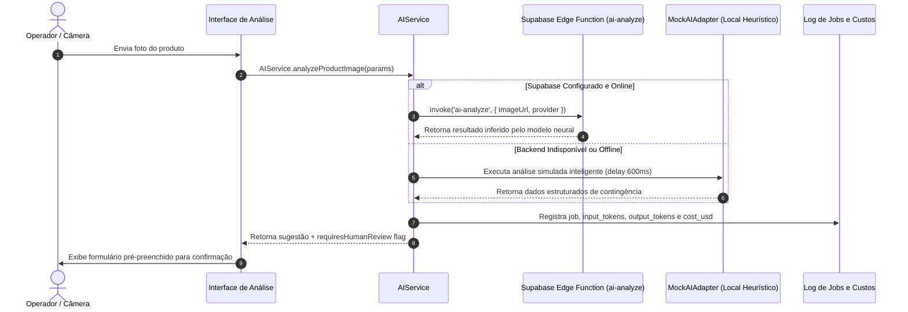
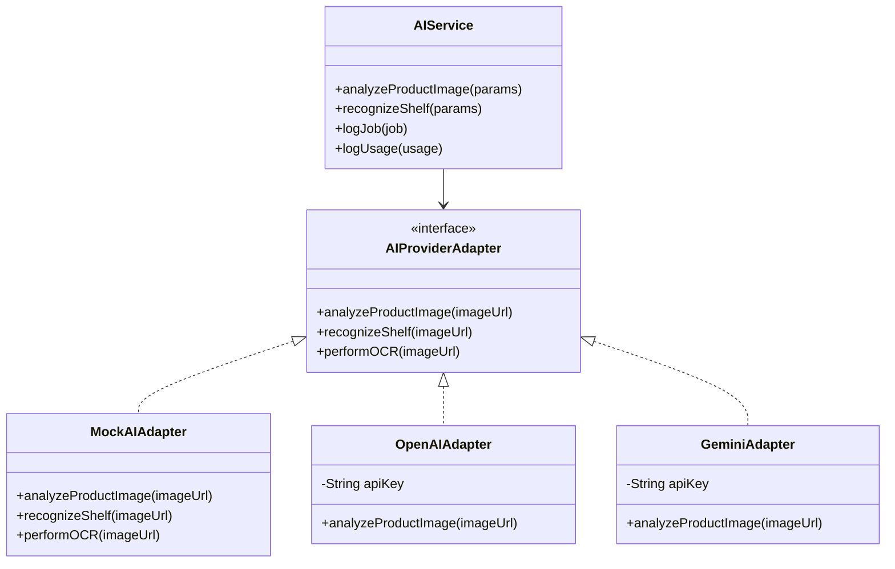

# 🧠 Pipeline Multimodal de IA e Visão Computacional

## 1. Objetivo
Descrever o pipeline de inteligência artificial multimodal com visão computacional para o varejo (`src/services/ai/ai-service.ts`), responsável pelo reconhecimento fotográfico de produtos e gôndolas.

---

## 2. Visão Geral
O **MarketFlow AI Vision** permite que operadores de loja utilizem fotos capturadas por celular ou câmeras de gôndola para:
1. **Cadastro Automático de Produtos:** Extrai nome comercial, código de barras, unidade e sugere preço com base na margem padrão (65%).
2. **Reconhecimento de Prateleira (Ruptura de Estoque):** Detecta lacunas vazias em gôndolas e calcula o score de itens faltantes.
3. **Extração de Validade via OCR:** Identifica datas de validade impressas em embalagens.

A arquitetura protege as chaves dos modelos de IA utilizando **Supabase Edge Functions** como proxy seguro e implementa um **Fallback Heurístico Local** quando a rede está inacessível.

---

## 3. Responsabilidades do Módulo
- Delegar a inferência para a Edge Function `supabase.functions.invoke('ai-analyze')` no backend.
- Prover o adaptador de contingência `MockAIAdapter` para homologação e operação offline.
- Avaliar a pontuação de confiança (`confidence_score`). Quando inferior a 0.85, sinalizar `requires_human_review: true`.
- Registrar auditoria de consumo e custos estimados em dólares no log de uso de IA.

---

## 4. Fluxo Interno: Execução de Análise Visual



---

## 5. Relação com Outros Módulos
- **[Gestão de Produtos e Validade](../modules/01-produtos-e-validade.md):** Alimenta o formulário de cadastro de produtos com os dados extraídos.
- **[Controle de Estoque e Lotes](../modules/02-estoque-e-lotes.md):** Apoia a conferência de entrada de mercadorias por lote.
- **[Modelo Relacional de Dados](../architecture/02-modelo-de-dados.md):** Persiste o histórico de processamento nas tabelas de auditoria.

---

## 6. Diagrama de Classes do Serviço de IA



---

## 7. Exemplos Práticos

### Payload de Resposta da Análise de Imagem
```json
{
  "suggested_name": "Café Torrado e Moído Gourmet 500g",
  "suggested_description": "Café 100% Arábica de torra média com notas achocolatadas.",
  "suggested_price": 24.90,
  "suggested_cost_price": 15.20,
  "barcode": "7891000123456",
  "unit": "UN",
  "suggested_category": "Bebidas & Matinais",
  "suggested_brand": "Café do Ponto",
  "confidence_score": 0.92,
  "notes": "Rótulo frontal legível com código de barras NCM identificável."
}
```

---

## 8. Referências para Outros Documentos
- [Gestão de Produtos e Validade](../modules/01-produtos-e-validade.md)
- [Modelo Relacional de Dados](../architecture/02-modelo-de-dados.md)
- [Gerenciamento de Estado](../architecture/03-gerenciamento-de-estado.md)
