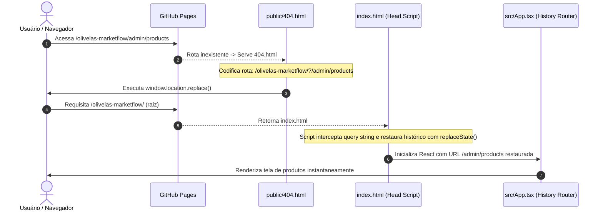
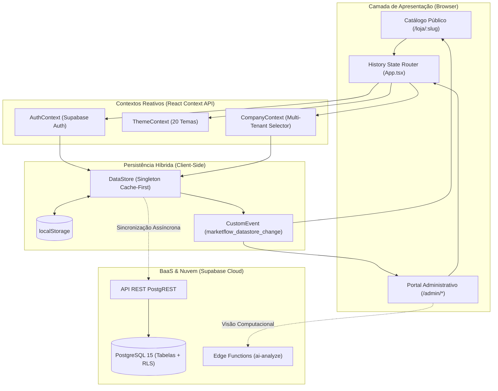

# 🏛️ Visão Geral da Arquitetura e Topologia Global

## 1. Objetivo
Este documento define a topologia sistêmica do **Olivelas MarketFlow**, detalhando os princípios não-funcionais, a divisão em camadas cliente-servidor e a estratégia de execução do Single Page Application (SPA) em servidores de arquivos estáticos.

---

## 2. Visão Geral
O MarketFlow é uma aplicação web baseada em **React 18**, **TypeScript** e **Tailwind CSS**, operando com um Backend-as-a-Service (**Supabase / PostgreSQL 15**). A solução adota a filosofia **Offline-First com Degradação Graciosa**: a aplicação nunca bloqueia a navegação ou a entrada de dados em caso de lentidão ou ausência de conectividade com a nuvem.

Toda a camada frontend é hospedada no **GitHub Pages** (ambiente puramente estático), sem um servidor Node.js ou SSR intermediário, reduzindo o custo operacional de infraestrutura a zero.

---

## 3. Responsabilidades do Módulo
- Fornecer o runtime de interface reativa para operadores de loja e clientes finais.
- Resolver rotas e deep-links no navegador sem depender de reescritas do servidor web (`mod_rewrite` ou `nginx`).
- Gerenciar os limites de contexto entre a área administrativa restrita (`/admin`) e o catálogo público (`/loja/:slug`).
- Orquestrar a comunicação entre os componentes visuais e o motor de persistência híbrida.

---

## 4. Fluxo Interno: O "Hack" de Roteamento SPA no GitHub Pages

### O Problema do Roteamento em Servidores Estáticos
Servidores estáticos procuram arquivos físicos no disco. Quando um usuário acessa diretamente `https://pycriador.github.io/olivelas-marketflow/admin/products`, o GitHub Pages não encontra o arquivo `admin/products.html` e emite **HTTP 404**.

### A Solução em 2 Estágios (Redirect SPA Bypass)
O MarketFlow implementa o padrão industrial de redirecionamento em dois passos:

1. **Captura no `public/404.html`:** O arquivo de erro 404 captura o caminho requisitado, codifica a URI em parâmetros de busca (`/?/admin/products`) e executa um `window.location.replace`.
2. **Decodificação no `<head>` do `index.html`:** Antes do React inicializar, um script inline decodifica a query string e restaura o endereço original no histórico do browser via `window.history.replaceState()`.
3. **Roteador Vanilla no `src/App.tsx`:** O roteador customizado escuta o evento global `popstate` e atualiza a visualização sem recarregar a página.



---

## 5. Relação com Outros Módulos
- **[Modelo Relacional de Dados](02-modelo-de-dados.md):** Consome os schemas e endpoints PostgREST mapeados.
- **[Gerenciamento de Estado](03-gerenciamento-de-estado.md):** Inicializa o singleton `DataStore` durante o bootstrap do `App.tsx`.
- **[Autenticação e Tenancy](../security/01-autenticacao-e-tenancy.md):** Alimenta o `AuthContext` para proteção condicional de rotas.

---

## 6. Diagrama Arquitetural em Camadas



---

## 7. Exemplos Práticos

### Snippet do Interceptor SPA no `index.html`
```html
<script type="text/javascript">
  (function(l) {
    if (l.search[1] === '/' ) {
      var decoded = l.search.slice(1).split('&').map(function(s) { 
        return s.replace(/~and~/g, '&')
      }).join('?');
      window.history.replaceState(null, null,
          l.pathname.slice(0, -1) + decoded + l.hash
      );
    }
  }(window.location))
</script>
```

---

## 8. Referências para Outros Documentos
- [Modelo Relacional de Dados](02-modelo-de-dados.md)
- [Gerenciamento de Estado e Sincronização](03-gerenciamento-de-estado.md)
- [Autenticação e Tenancy](../security/01-autenticacao-e-tenancy.md)
- [Design System e 20 Temas](../frontend/01-design-system-e-temas.md)
