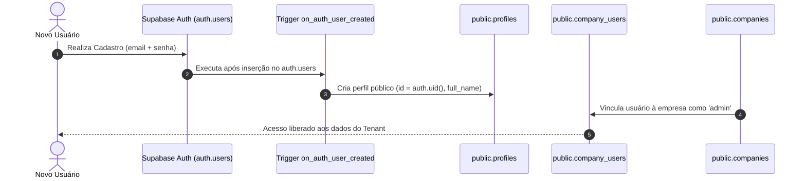
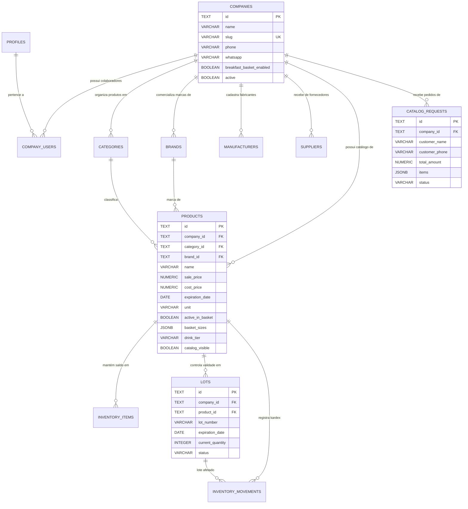

# 🗄️ Modelo Relacional de Dados e Segurança RLS

## 1. Objetivo
Especificar a modelagem de dados relacional oficial do **Olivelas MarketFlow**, as convenções de integridade referencial, a utilização de chaves primárias semânticas e as políticas de segurança a nível de linha (Row Level Security - RLS).

---

## 2. Visão Geral
O banco de dados é hospedado no **PostgreSQL 15** fornecido pelo Supabase. O esquema foi estruturado para atender a operações multi-empresa com isolamento estrito via `company_id` e relacionamento com os perfis de usuários autenticados (`profiles` vinculados a `auth.users`).

Um dos diferenciais do sistema é a adoção de **Chaves Primárias Naturais Semânticas** (`TEXT PRIMARY KEY`) para entidades de catálogo e configuração. Isso permite que códigos de barras, QR codes impressos em etiquetas e URLs amigáveis façam referência direta ao registro sem sobrecarga de mapeamento.

---

## 3. Responsabilidades do Módulo
- Garantir a persistência confiável de transações mercantis, produtos, clientes e pedidos.
- Aplicar regras de autorização no nível do banco via PostgreSQL Row Level Security (RLS).
- Manter o histórico de movimentações de estoque (Kardex) para auditoria e rastreabilidade sanitária.
- Sincronizar perfis de usuário automaticamente através do trigger `handle_new_user`.

---

## 4. Fluxo Interno: Ciclo de Criação de Perfil e Inquilinato



---

## 5. Diagrama Entidade-Relacionamento (ER)



---

## 6. Relação com Outros Módulos
- **[Gerenciamento de Estado](03-gerenciamento-de-estado.md):** Todas as entidades mapeadas neste modelo possuem correspondência direta no `localStorage` e no `DataStore`.
- **[Gestão de Produtos e Validade](../modules/01-produtos-e-validade.md):** Utiliza as colunas `expiration_date`, `basket_sizes` e `drink_tier` da tabela `products`.
- **[Controle de Estoque e Lotes](../modules/02-estoque-e-lotes.md):** Opera diretamente sobre `inventory_items`, `lots` e `inventory_movements`.

---

## 7. Exemplos Práticos

### DDL Canônica da Tabela `products`
```sql
CREATE TABLE public.products (
  id TEXT PRIMARY KEY,
  company_id TEXT NOT NULL REFERENCES public.companies(id) ON DELETE CASCADE,
  category_id TEXT REFERENCES public.categories(id) ON DELETE SET NULL,
  brand_id TEXT REFERENCES public.brands(id) ON DELETE SET NULL,
  name VARCHAR(200) NOT NULL,
  description TEXT,
  sku VARCHAR(50),
  barcode VARCHAR(50),
  unit VARCHAR(20) NOT NULL DEFAULT 'UN',
  cost_price NUMERIC(10,2) NOT NULL DEFAULT 0.00,
  sale_price NUMERIC(10,2) NOT NULL DEFAULT 0.00,
  minimum_stock INTEGER NOT NULL DEFAULT 0,
  maximum_stock INTEGER NOT NULL DEFAULT 0,
  expiration_date DATE,
  active BOOLEAN NOT NULL DEFAULT true,
  catalog_visible BOOLEAN NOT NULL DEFAULT true,
  active_in_basket BOOLEAN NOT NULL DEFAULT true,
  basket_sizes JSONB,               -- Ex: ["pequena", "media", "grande"]
  drink_tier VARCHAR(10),           -- Ex: 'P', 'M', 'G' ou NULL
  image_url TEXT,
  created_at TIMESTAMPTZ NOT NULL DEFAULT now(),
  updated_at TIMESTAMPTZ NOT NULL DEFAULT now()
);
```

### Política RLS para Catálogo Público
```sql
-- Visitantes podem visualizar empresas ativas e catálogo sem login
CREATE POLICY "Active companies viewable publicly" 
ON public.companies FOR SELECT 
USING (active = true);

CREATE POLICY "Public read products" 
ON public.products FOR SELECT 
USING (active = true);
```

---

## 8. Referências para Outros Documentos
- [Visão Geral da Arquitetura](01-visao-geral.md)
- [Gerenciamento de Estado](03-gerenciamento-de-estado.md)
- [Gestão de Produtos e Validade](../modules/01-produtos-e-validade.md)
- [Controle de Estoque e Lotes](../modules/02-estoque-e-lotes.md)
- [Autenticação e Tenancy](../security/01-autenticacao-e-tenancy.md)
