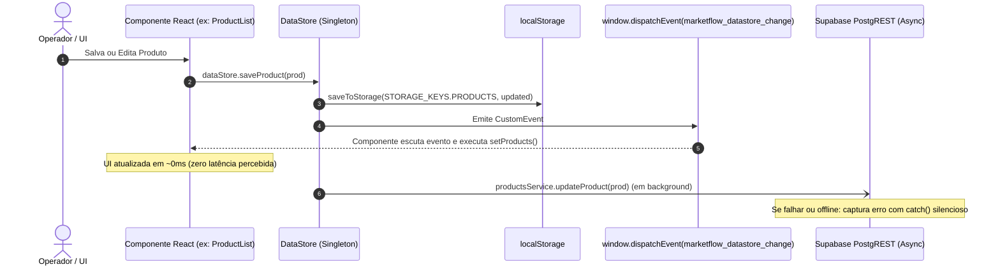
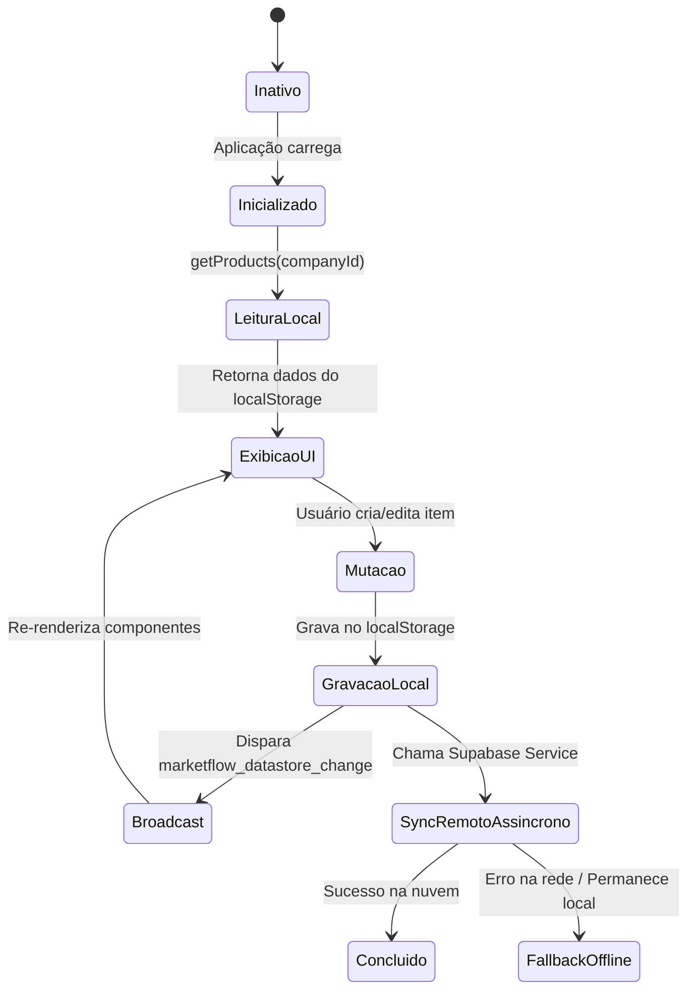

# ⚡ Gerenciamento de Estado e Sincronização Híbrida

## 1. Objetivo
Descrever o padrão de persistência híbrida e gerenciamento de estado reativo implementado pela classe singleton `DataStore` (`src/lib/data-store.ts`).

---

## 2. Visão Geral
O MarketFlow utiliza uma abordagem **Cache-First Reativa**:
1. O usuário nunca espera por requisições de rede para interagir com o sistema.
2. Toda alteração de dados é salva de forma síncrona e imediata no `localStorage`.
3. Um evento customizado de broadcast (`marketflow_datastore_change`) é emitido na janela do navegador para notificar instantaneamente todos os componentes React em execução.
4. Em segundo plano (assincronamente), a mutação é enviada para os serviços PostgREST do Supabase.
5. Em caso de falha de conexão com o Supabase, a aplicação não interrompe a operação e continua com o estado local íntegro.

---

## 3. Responsabilidades do Módulo
- Abstrair as operações CRUD de todas as entidades do sistema.
- Gerenciar as chaves de particionamento local (`marketflow_all_products`, `marketflow_all_companies`, etc.).
- Emitir e escutar o evento nativo `marketflow_datastore_change`.
- Realizar o merge dos dados do banco remoto com o cache local através do método `syncWithRemote()`.

---

## 4. Fluxo Interno: Mutação Otimista e Sincronização



---

## 5. Relação com Outros Módulos
- **[Visão Geral da Arquitetura](01-visao-geral.md):** Integrado diretamente ao ciclo de vida da aplicação.
- **[Gestão de Produtos e Validade](../modules/01-produtos-e-validade.md):** Provê os métodos `getProducts`, `saveProduct` e `deleteProduct`.
- **[Controle de Estoque e Lotes](../modules/02-estoque-e-lotes.md):** Provê métodos de consulta e movimentação de inventário e lotes.
- **[Motor de Cestas de Café](../modules/03-cestas-de-cafe.md):** Alimenta o catálogo de montagem com os dados da empresa e produtos.

---

## 6. Diagrama de Estados do DataStore



---

## 7. Exemplos Práticos

### Disparo e Escuta Reativa do Evento
```typescript
// Dentro do DataStore (src/lib/data-store.ts):
function saveToStorage<T>(key: string, data: T): void {
  if (typeof window === 'undefined') return;
  try {
    localStorage.setItem(key, JSON.stringify(data));
    window.dispatchEvent(new CustomEvent('marketflow_datastore_change', { detail: { key } }));
  } catch (err) {
    console.error('Erro ao salvar no localStorage:', err);
  }
}

// Dentro do Componente React (ex: product-list.tsx):
React.useEffect(() => {
  const handleUpdate = () => {
    setProducts(dataStore.getProducts(currentCompany?.id));
  };
  window.addEventListener('marketflow_datastore_change', handleUpdate);
  return () => window.removeEventListener('marketflow_datastore_change', handleUpdate);
}, [currentCompany]);
```

---

## 8. Referências para Outros Documentos
- [Visão Geral da Arquitetura](01-visao-geral.md)
- [Modelo Relacional de Dados](02-modelo-de-dados.md)
- [Gestão de Produtos e Validade](../modules/01-produtos-e-validade.md)
- [Controle de Estoque e Lotes](../modules/02-estoque-e-lotes.md)
