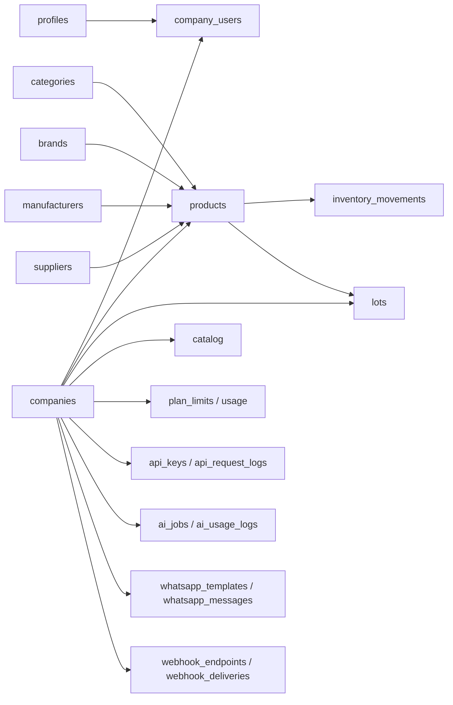

# MarketFlow — Data Model

> Language: EN | [Português (pt-BR)](../../pt-BR/architecture/data-model.md)
>
> Status: DRAFT
>
> Documentation Standard v1.0

Source: [`sdd/02-DATABASE.md`](../../../sdd/02-DATABASE.md), entities in [`sdd/10-FULL-SYSTEM.md`](../../../sdd/10-FULL-SYSTEM.md) and schemas in [`sdd/12-EXTRAS.md`](../../../sdd/12-EXTRAS.md).

## Purpose

What the reader learns: MarketFlow logical schema, core entities, multi-tenant isolation and cross-cutting data concerns. Logical view — not a full column catalog. **Implementation:** `supabase/migrations/` defines 19 tables (RLS enabled); several SDD tables are not yet created.

## Schemas / namespaces

| Schema / store | Purpose | Owner | Classification |
| --- | --- | --- | --- |
| `public` (PostgreSQL) | Product, catalog, API, AI and WhatsApp data | marketflow-team | Implemented (partial) |
| Supabase Auth (schema `auth`) | Identity/users | Supabase (managed) | Confirmed (SDD) |
| Supabase Storage (`storage.objects`) | Images/logos with tenant metadata | Supabase (managed) | Confirmed (SDD) |

## Core entities

| Entity | Store | Responsibility | Classification |
| --- | --- | --- | --- |
| `profiles` | PostgreSQL | User profile (non-auth identity data) | Implemented |
| `companies` | PostgreSQL | Main tenant; name, CNPJ, unique slug, status | Implemented |
| `users` | Supabase Auth (identity) | Login credentials (no business roles) | Confirmed (SDD) |
| `company_users` | PostgreSQL | User–company binding; `role` (`GLOBAL_ADMIN`/`ADMIN`/`STOCK`/`VISITOR`) | Implemented |
| `categories` | PostgreSQL | Product organization; optional hierarchy | Implemented |
| `brands` | PostgreSQL | Brands | Implemented |
| `manufacturers` | PostgreSQL | Manufacturers | Implemented |
| `suppliers` | PostgreSQL | Suppliers | Implemented |
| `products` | PostgreSQL | Products (SKU/barcode unique per company, unit, prices, min/max, images, visibility) | Implemented |
| `inventory_items` | PostgreSQL | Inventory state per product (company-scoped) | Implemented |
| `lots` | PostgreSQL | Lots and expiry; initial/current quantity, cost, validity status | Implemented |
| `inventory_movements` | PostgreSQL | Immutable inventory movements (entry, exit, adjustment, loss, count); history | Implemented |
| `api_keys` | PostgreSQL | API Keys (`secret_hash` only), company, scopes, environment, status, expiry | Implemented |
| `api_request_logs` | PostgreSQL | Per-request audit (token, scope, status, route, latency) | Implemented |
| `ai_jobs` | PostgreSQL | Async AI jobs (status, provider, model, result/confidence) | Implemented |
| `ai_usage_logs` | PostgreSQL | AI usage/cost per company (tokens, estimated cost) | Implemented |
| `whatsapp_templates` | PostgreSQL | Message templates per company/language (PT-BR/EN/ES) | Implemented |
| `whatsapp_messages` | PostgreSQL | Message history with status and retry | Implemented |
| `webhook_endpoints` | PostgreSQL | Outbound webhook config (URL, secret, events, status) | Implemented |
| `webhook_deliveries` | PostgreSQL | Delivery attempts (status, retries, response/signature) | Implemented |
| `catalog_requests` | PostgreSQL | Catalog contact/order requests | Not created (FK ref only) |
| `catalog_*` | PostgreSQL | Catalog configuration (storefront by slug) | Not created |
| `plan_limits` / `usage` | PostgreSQL | Plan limits and usage per company (billing/entitlements) | Not created |
| `notifications` | PostgreSQL | In-app notifications | Not created |

Total: **19 tables implemented** in `20260905000000_initial_schema.sql` (11) + `20260905000002_api_ai_whatsapp_schema.sql` (8). Seed in `20260905000001_seed_global_admin.sql`.

## Relationships (high level)

## Multi-tenant isolation

- **Strategy:** shared PostgreSQL database with logical isolation.
- **Mandatory column:** `company_id UUID NOT NULL` on all business tables (`products`, `categories`, `brands`, `manufacturers`, `suppliers`, movements, lots, `api_keys`, `ai_*`, `whatsapp_*`, `webhook_*`, etc.).
- **RLS:** enabled on all 19 implemented tables. **Current gap:** only 6 policies defined (`companies`, `products` ×2, `api_keys`, `whatsapp_templates`, `whatsapp_messages`) — remaining tables deny by default until policies are added.
- **Primary keys:** `UUID` via `gen_random_uuid()`; no sequential IDs exposed publicly.
- **Slug,** SKU/barcode, category hierarchy: uniqueness validated **per company**.

## Cross-cutting data concerns

| Concern | Approach | Classification |
| --- | --- | --- |
| Multi-tenancy / isolation | `company_id UUID NOT NULL` + RLS on all business tables | Implemented (policies partial) |
| Secret handling | `api_keys` stores only `secret_hash`; full key shown once at creation | Implemented |
| Soft delete / archive | Logical deletion where appropriate (e.g., categories); movements **never** deleted | Proposed |
| PII / retention | LGPD: consent and retention flows to be documented; minimal necessary | Proposed |
| Encryption at rest (app-level) | Supabase/managed; no custom encryption in the MVP | Inferred |

## Integrity rules (SDD summary)

- SKU/barcode deduplication **per company**; prices cannot be negative.
- Product and inventory are separate concepts; movements transactional and immutable; corrections generate adjustments.
- Lots: expired product ≠ normal available stock.
- Public catalog: only active and published products; **never** expose `cost_price`, margin, supplier, users or audit data.
- API Keys: token prefixes `mf_live_`/`mf_test_`; secret not stored in plain text; scopes enforced on every request.
- WhatsApp templates: placeholders validated; unknown placeholders blocked before saving; language fallback.
- Initial Free plan: up to 3 companies per user, 100 products per company, 3 users per company (see [ADR-006](../decisions/adr-006-monetization-free-first.md)).

## Related

- Architecture overview: [overview.md](overview.md)
- Contracts exposing these entities: [contracts/api.md](../contracts/api.md)
- Security (RLS, Storage, data protection): [security/security.md](../security/security.md)
- Sensitive data: [security/authorization.md](../security/authorization.md)
- Schema source: `supabase/migrations/` (implementation) and `sdd/12-EXTRAS.md` (spec)