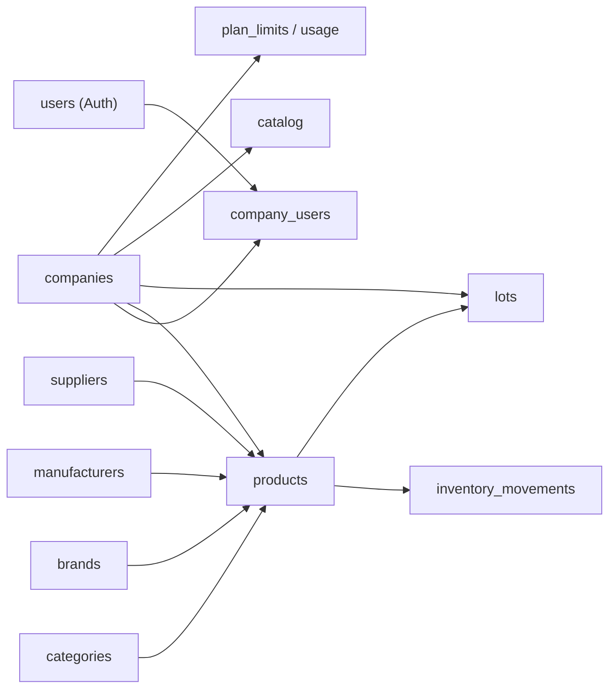

# MarketFlow — Data Model

> Language: EN | [Português (pt-BR)](../../pt-BR/architecture/data-model.md)
>
> Status: DRAFT
>
> Documentation Standard v1.0

Source: [`sdd/02-DATABASE.md`](../../../sdd/02-DATABASE.md) and entities described in [`sdd/10-FULL-SYSTEM.md`](../../../sdd/10-FULL-SYSTEM.md) (PRODUCT, INVENTORY, LOTS, CATALOG, COMPANY, USERS, etc.).

## Purpose

What the reader learns: MarketFlow logical schema, core entities, multi-tenant isolation and cross-cutting data concerns. Logical view — not a full column catalog.

## Schemas / namespaces

| Schema / store | Purpose | Owner | Classification |
| --- | --- | --- | --- |
| `public` (PostgreSQL) | Product data | marketflow-team | Proposed |
| Supabase Auth (schema `auth`) | Identity/users | Supabase (managed) | Confirmed (SDD) |
| Supabase Storage (`storage.objects`) | Images/logos with tenant metadata | Supabase (managed) | Confirmed (SDD) |

## Core entities

| Entity | Store | Responsibility | Classification |
| --- | --- | --- | --- |
| `companies` | PostgreSQL | Main tenant; name, CNPJ, unique slug, status | Proposed |
| `users` | Supabase Auth (identity) | Login credentials (no business roles) | Proposed |
| `company_users` | PostgreSQL | User–company binding; `role` (`GLOBAL_ADMIN`/`ADMIN`/`STOCK`/`VISITOR`) | Proposed |
| `categories` | PostgreSQL | Product organization; optional hierarchy | Proposed |
| `brands` | PostgreSQL | Brands | Proposed |
| `manufacturers` | PostgreSQL | Manufacturers | Proposed |
| `suppliers` | PostgreSQL | Suppliers | Proposed |
| `products` | PostgreSQL | Products (SKU/barcode unique per company, unit, prices, min/max, images, visibility) | Proposed |
| `inventory_movements` | PostgreSQL | Immutable inventory movements (entry, exit, adjustment, loss, count); history | Proposed |
| `lots` | PostgreSQL | Lots and expiry; initial/current quantity, cost, validity status | Proposed |
| `catalog_*` | PostgreSQL | Catalog configuration and requests | Proposed |
| `plan_limits` / `usage` | PostgreSQL | Plan limits and usage per company (billing/entitlements) | Proposed |
| `notifications` | PostgreSQL | In-app notifications | Proposed |

## Relationships (high level)

## Multi-tenant isolation

- **Strategy:** shared PostgreSQL database with logical isolation.
- **Mandatory column:** `company_id UUID NOT NULL` on all business tables (`products`, `categories`, `brands`, `manufacturers`, `suppliers`, products, movements, lots, catalog, etc.).
- **RLS:** Row Level Security enabled; policies by role + `company_id`. Default statement: `company_id` is not a source of trust from the client — derived from the session/RLS.
- **Primary keys:** `UUID` via `gen_random_uuid()`; no sequential IDs exposed publicly.
- **Slug,** SKU/barcode, category hierarchy: uniqueness validated **per company**.

## Cross-cutting data concerns

| Concern | Approach | Classification |
| --- | --- | --- |
| Multi-tenancy / isolation | `company_id UUID NOT NULL` + RLS on all business tables | Proposed |
| Soft delete / archive | Logical deletion where appropriate (e.g., categories); movements **never** deleted | Proposed |
| PII / retention | LGPD: consent and retention flows to be documented; minimal necessary | Proposed |
| Encryption at rest (app-level) | Supabase/managed; no custom encryption in the MVP | Inferred |

## Integrity rules (SDD summary)

- SKU/barcode deduplication **per company**; prices cannot be negative.
- Product and inventory are separate concepts; movements transactional and immutable; corrections generate adjustments.
- Lots: expired product ≠ normal available stock.
- Public catalog: only active and published products; **never** expose `cost_price`, margin, supplier, users or audit data.
- Initial Free plan: up to 3 companies per user, 100 products per company, 3 users per company (see [ADR-006](../decisions/adr-006-monetization-free-first.md)).

## Related

- Architecture overview: [overview.md](overview.md)
- Contracts exposing these entities: [contracts/api.md](../contracts/api.md)
- Security (RLS, Storage, data protection): [security/security.md](../security/security.md)
- Sensitive data: [security/authorization.md](../security/authorization.md)