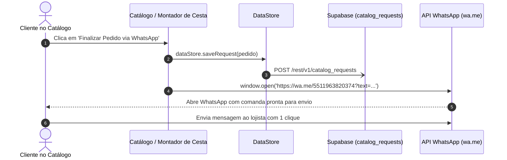

# 💬 Checkout e Despacho via WhatsApp

## 1. Objetivo
Documentar a integração do catálogo público com a API de Deep Link do WhatsApp para fechamento ágil de pedidos sem atrito de cadastro.

---

## 2. Visão Geral
No varejo de proximidade e no comércio especializado em presentes, a taxa de conversão aumenta drasticamente quando o comprador não é forçado a preencher formulários de checkout com dados de cartão de crédito.

O MarketFlow adota o fluxo de **Conversão Direta via WhatsApp**:
1. O cliente escolhe os produtos ou monta sua cesta no catálogo da loja.
2. O sistema valida as regras e totaliza o pedido.
3. Um registro de intent de compra é salvo no banco (`catalog_requests`).
4. Uma mensagem em Markdown estruturada é gerada e codificada na URL oficial `https://wa.me/{numero}?text={texto}`.
5. O WhatsApp Web ou aplicativo mobile do cliente é aberto com a comanda pronta para envio.

---

## 3. Responsabilidades do Módulo
- Sanitizar o número de telefone da empresa no padrão internacional E.164 (ex: `5511963820374`).
- Codificar os caracteres especiais e quebras de linha com `encodeURIComponent`.
- Gravar o registro histórico em `catalog_requests` no Supabase e `DataStore`.
- Disparar a navegação externa transparente para o usuário.

---

## 4. Fluxo Interno: Sequência de Checkout via WhatsApp



---

## 5. Relação com Outros Módulos
- **[Motor de Cestas de Café](../modules/03-cestas-de-cafe.md):** É o principal originador de pedidos customizados para o WhatsApp.
- **[Modelo Relacional de Dados](../architecture/02-modelo-de-dados.md):** Grava o registro estruturado na tabela `catalog_requests`.
- **[Gerenciamento de Estado](../architecture/03-gerenciamento-de-estado.md):** Mantém o histórico no cache local da aplicação.

---

## 6. Exemplos Práticos

### Função de Geração do Link no Código
```typescript
export function buildWhatsAppOrderLink(
  phone: string,
  storeName: string,
  items: { name: string; quantity: number; price: number }[],
  total: number,
  customerName?: string
): string {
  const cleanPhone = phone.replace(/\D/g, '');
  
  let msg = `*Novo Pedido - ${storeName}*\n`;
  msg += `-----------------------------------\n`;
  items.forEach(item => {
    msg += `- ${item.quantity}x ${item.name} (R$ ${item.price.toFixed(2).replace('.', ',')})\n`;
  });
  msg += `\n*Total: R$ ${total.toFixed(2).replace('.', ',')}*\n`;
  if (customerName) {
    msg += `Cliente: ${customerName}\n`;
  }

  return `https://wa.me/${cleanPhone}?text=${encodeURIComponent(msg)}`;
}
```

---

## 7. Referências para Outros Documentos
- [Motor de Cestas de Café](../modules/03-cestas-de-cafe.md)
- [Modelo Relacional de Dados](../architecture/02-modelo-de-dados.md)
- [Gerenciamento de Estado](../architecture/03-gerenciamento-de-estado.md)
