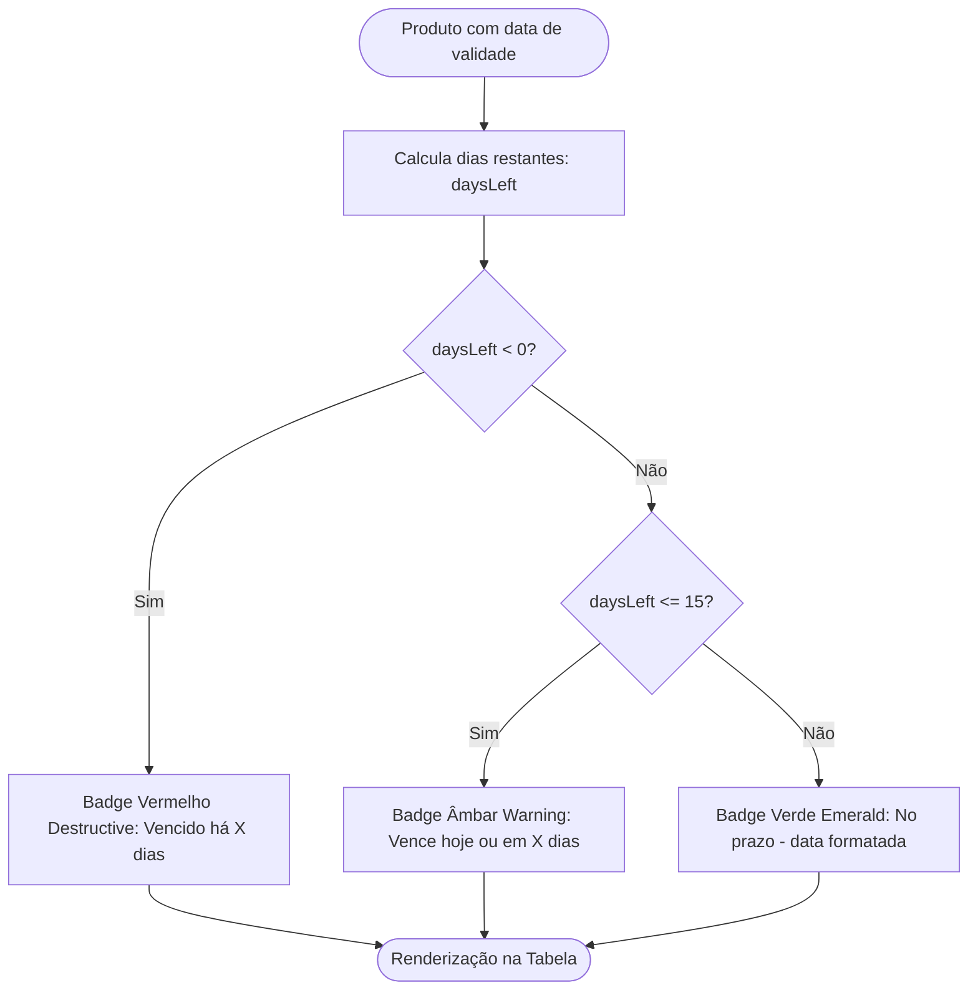

# 🍎 Gestão de Produtos e Controle de Validade

## 1. Objetivo
Especificar as regras de cadastro, busca, paginação e o motor de controle de datas de validade de itens perecíveis no **Olivelas MarketFlow**.

---

## 2. Visão Geral
O módulo de produtos centraliza o inventário mercantil da loja, unindo informações comerciais (preços, código de barras, SKU) a metadados operacionais críticos:
1. **Controle de Validade Tricolor:** Indicadores visuais imediatos de vencimento.
2. **Shelf-Life Preditivo:** Sugestão inteligente de vida útil no momento do cadastro por categoria.
3. **Filtros Paramétricos em Dropdown:** Busca combinada com sincronização automática na URL (`window.history.pushState`).
4. **Paginação com Seletor 10, 20 ou 30 itens:** Navegação consistente em tabelas densas.

---

## 3. Responsabilidades do Módulo
- Manter o cadastro de produtos sincronizado entre `localStorage` e Supabase.
- Computar dinamicamente os dias restantes para o vencimento (`daysLeft = expirationDate - hoje`).
- Exibir alertas nas listagens: Vencido (vermelho), Vencendo logo $le 15$ dias (âmbar) e No prazo (verde).
- Expor dados para o gerador de etiquetas de gôndola e para o catálogo de cestas.

---

## 4. Fluxo Interno: Classificação de Validade



---

## 5. Relação com Outros Módulos
- **[Gerenciamento de Estado](../architecture/03-gerenciamento-de-estado.md):** Lê e persiste itens via `dataStore.getProducts()` e `dataStore.saveProduct()`.
- **[Controle de Estoque e Lotes](02-estoque-e-lotes.md):** Relaciona produtos a saldos de inventário consolidado e lotes de fabricação.
- **[Motor de Cestas de Café](03-cestas-de-cafe.md):** Fornece produtos ativos com as flags `active_in_basket`, `basket_sizes` e `drink_tier`.
- **[Motor de Etiquetas Térmicas](04-etiquetas-termicas.md):** Envia dados de preço, código de barras e unidade para impressão física.

---

## 6. Tabela de Shelf-Life Preditivo por Categoria

Quando um produto é cadastrado e não possui validade informada, a função `getRealExpirationDate` aplica a vida útil recomendada:

| Categoria Biológica | Prazo Estimado | Exemplos no Sistema |
| :--- | :--- | :--- |
| **Frutas Frescas** | 3 a 7 dias | Banana Prata (3d), Mamão Papaya (5d), Uva (7d) |
| **Frios e Queijos Fatiados** | 5 a 15 dias | Presunto Seara (5d), Queijo Prato (12d), Mussarela (15d) |
| **Padaria Artesanal** | 3 a 5 dias | Croissant Francês (3d), Rosca Doce (5d) |
| **Panificação Industrial** | 14 a 18 dias | Pão de Forma Pullman (14d), Bisnaguinha (18d) |
| **Laticínios Líquidos** | 7 a 14 dias | Iogurte Danone (7d), Leite Fresco (14d) |
| **Sucos e Refrigerantes UHT** | 45 a 120 dias | Suco de Soja Ades (45d), Suco de Uva Integral (120d) |
| **Mercearia Seca & Biscoitos** | 90 a 150 dias | Biscoito Club Social (90d), Cream Cracker (120d) |
| **Doces e Geleias Lacradas** | 180 a 365 dias | Mel Silvestre (365d), Doce de Leite Viçosa (180d) |
| **Canecas e Brindes** | `undefined` | Não perecível |

---

## 7. Exemplos Práticos

### Snippet de Renderização do Badge de Validade
```tsx
if (daysLeft !== null && daysLeft < 0) {
  return (
    <div className="inline-flex flex-col items-center">
      <Badge variant="destructive" className="text-[10px] py-0 px-1.5 font-mono">
        Vencido ({Math.abs(daysLeft)}d)
      </Badge>
      <span className="text-[10px] text-destructive font-mono mt-0.5">
        {formatDate(product.expiration_date)}
      </span>
    </div>
  );
}
```

---

## 8. Referências para Outros Documentos
- [Modelo Relacional de Dados](../architecture/02-modelo-de-dados.md)
- [Gerenciamento de Estado](../architecture/03-gerenciamento-de-estado.md)
- [Controle de Estoque e Lotes](02-estoque-e-lotes.md)
- [Motor de Cestas de Café](03-cestas-de-cafe.md)
- [Motor de Etiquetas Térmicas](04-etiquetas-termicas.md)
