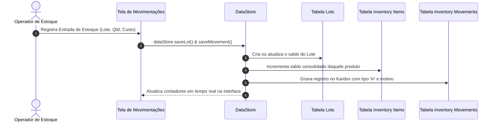
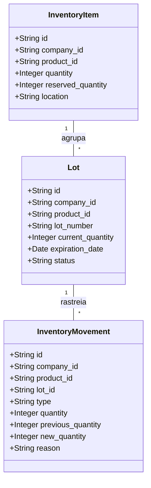

# 📦 Controle de Estoque, Lotes e Kardex

## 1. Objetivo
Documentar a arquitetura de inventário físico, o controle de rastreabilidade de lotes (`lots`) com data de vencimento específica e o histórico de movimentações contábeis de estoque (`inventory_movements`).

---

## 2. Visão Geral
O sistema mantém dois níveis de controle de estoque:
1. **Estoque Consolidado (`inventory_items`):** Mantém o saldo total (`quantity`) e a quantidade reservada (`reserved_quantity`) por produto e empresa.
2. **Rastreabilidade por Lote (`lots`):** Cada lote possui número identificador, data de fabricação, data de validade obrigatória, quantidade inicial e saldo atual.

Toda alteração de saldo gera uma entrada imutável no Kardex (`inventory_movements`), registrando motivo, documento de suporte e usuário responsável.

---

## 3. Responsabilidades do Módulo
- Registrar entradas de mercadorias vinculadas a fornecedores e notas fiscais.
- Efetuar baixas automáticas de estoque em montagens de kits e cestas.
- Fornecer relatórios de rupturas e produtos com saldo abaixo do estoque mínimo.
- Alimentar a visualização de lotes próximos ao vencimento para ações promocionais de desova preventiva.

---

## 4. Fluxo Interno: Movimentação de Estoque e Kardex



---

## 5. Relação com Outros Módulos
- **[Gestão de Produtos e Validade](01-produtos-e-validade.md):** Cada lote está associado a um `product_id` canônico.
- **[Motor de Cestas de Café](03-cestas-de-cafe.md):** Quando uma cesta é montada e despachada, as baixas são debitadas dos itens correspondentes.
- **[API Gateway](../integrations/01-api-gateway.md):** Expõe endpoints seguros para sincronização de saldo de estoque via REST.

---

## 6. Diagrama de Entidades de Estoque



---

## 7. Exemplos Práticos

### Objeto JSON de Registro de Kardex
```json
{
  "id": "mov-1042",
  "company_id": "comp-cesta-1",
  "product_id": "pb-pao-queijo-fdm",
  "lot_id": "lot-2026-09-fdm",
  "type": "out",
  "quantity": 2,
  "previous_quantity": 25,
  "new_quantity": 23,
  "reason": "Montagem Cesta Grande Pedido #9812",
  "document_reference": "PED-9812",
  "created_at": "2026-09-07T14:30:00.000Z"
}
```

---

## 8. Referências para Outros Documentos
- [Modelo Relacional de Dados](../architecture/02-modelo-de-dados.md)
- [Gestão de Produtos e Validade](01-produtos-e-validade.md)
- [Motor de Cestas de Café](03-cestas-de-cafe.md)
- [In-Browser API Gateway](../integrations/01-api-gateway.md)
