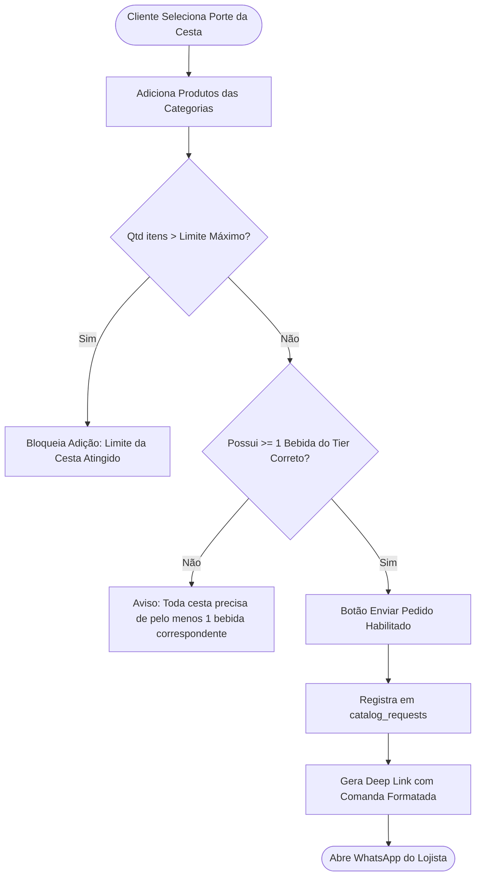

# 🧺 Motor de Cestas de Café da Manhã

## 1. Objetivo
Documentar as regras de negócio, restrições paramétricas de volumetria e a lógica de precificação do motor de montagem interativa de **Cestas de Café da Manhã**.

---

## 2. Visão Geral
O motor de cestas permite que clientes finais montem suas próprias cestas de presentes no catálogo público da loja (`/loja/:slug/cesta`). O sistema resolve a complexidade logística do varejo de cestas aplicando regras rígidas de capacidade e proporcionalidade:
- Limite máximo de itens por porte de cesta.
- **Trava Obrigatória de Bebidas:** Toda cesta exige pelo menos uma bebida compatível com o seu porte (evitando que uma cesta grande receba uma bebida pequena de 200ml ou vice-versa).
- **Cálculo Dinâmico em Tempo Real:** Atualização instantânea do valor conforme os itens são marcados.

---

## 3. Responsabilidades do Módulo
- Aplicar a matriz de restrições de porte (Pequena, Média, Grande).
- Validar se a cesta possui ao menos 1 bebida do `drink_tier` correspondente.
- Impedir que a contagem de itens ultrapasse o `maxItens` configurado.
- Gerar o payload estruturado para persistência em `catalog_requests` e despacho via WhatsApp.

---

## 4. Matriz Paramétrica de Portes de Cesta

| Porte | Preço Base | Limite de Itens | Restrição de Bebida (`drink_tier`) | Destaque Visual |
| :--- | :--- | :--- | :--- | :--- |
| **Pequena** | R$ 15,00 | Até 5 itens | Exige $ge 1$ bebida Tier "P" (~200 ml) | Econômica |
| **Média** | R$ 20,00 | Até 8 itens | Exige $ge 1$ bebida Tier "M" (~500 ml) | Mais Vendida (Badge Destaque) |
| **Grande** | R$ 25,00 | Até 12 itens | Exige $ge 1$ bebida Tier "G" (~1 Litro) | Premium / Família |

---

## 5. Fluxo Interno: Validação e Checkout da Cesta



---

## 6. Relação com Outros Módulos
- **[Gestão de Produtos e Validade](01-produtos-e-validade.md):** Os produtos exibidos respeitam as flags `active_in_basket: true` e `basket_sizes`.
- **[Checkout e Despacho via WhatsApp](../integrations/02-whatsapp-checkout.md):** Recebe o carrinho validado para codificação de URI e transmissão ao lojista.
- **[Controle de Estoque e Lotes](02-estoque-e-lotes.md):** Alimenta as baixas de estoque dos produtos envolvidos na cesta.

---

## 7. Exemplos Práticos

### Comanda Gerada no WhatsApp
```text
*Novo Pedido de Cesta - Cestas de Café da Manhã*
-----------------------------------
Tamanho: Cesta Média (R$ 20,00)

Itens Escolhidos:
- 1x Suco Natural One Laranja 500 ml (R$ 10,90)
- 1x Pão de Queijo Forno de Minas (R$ 16,90)
- 1x Presunto Seara Fatiado 200g (R$ 8,90)
- 1x Caneca Personalizada (R$ 24,90)

*Total do Pedido: R$ 81,60*
Cliente: Roberto Silva
Telefone: (11) 96382-0374
```

---

## 8. Referências para Outros Documentos
- [Modelo Relacional de Dados](../architecture/02-modelo-de-dados.md)
- [Gestão de Produtos e Validade](01-produtos-e-validade.md)
- [Checkout e Despacho via WhatsApp](../integrations/02-whatsapp-checkout.md)
