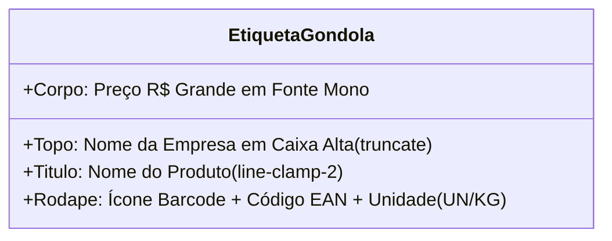

# 🏷️ Motor de Etiquetas Térmicas de Gôndola

## 1. Objetivo
Especificar o motor de visualização e geração de etiquetas de gôndola e código de barras (`src/pages/admin/products/product-labels.tsx`) para impressoras de bobina térmica e folhas A4 de etiquetas adesivas.

---

## 2. Visão Geral
Para garantir a operação integrada entre o sistema digital e a loja física, o MarketFlow inclui um módulo de geração de etiquetas de prateleira compatível com qualquer impressora instalada no sistema operacional (Epson, Zebra, Argox ou impressoras jato de tinta/laser comuns).

O módulo opera em **CSS Print Media** nativo (`@media print`), eliminando a necessidade de drivers proprietários ou plugins externos.

---

## 3. Responsabilidades do Módulo
- Permitir seleção individual ou em lote de produtos para etiquetagem.
- Exibir pré-visualização em tempo real das etiquetas antes do disparo da impressão.
- Formatar o layout em grid balanceado de 3 ou 4 colunas com quebra de página automática (`break-inside: avoid`).
- Renderizar em alto contraste: Nome da Loja, Nome do Produto em 2 linhas, Preço de Venda em destaque e representação de código de barras com unidade de medida.

---

## 4. Fluxo Interno: Seleção e Disparo da Impressão

```mermaid
flowchart TD
    Inicio([Acesso à tela /admin/products/labels]) --> Tabela[Tabela com Filtros e Seleção com Checkboxes]
    Tabela --> Escolha[Marca produtos para impressão]
    Escolha --> Preview[Preview em grade das etiquetas na tela]
    Preview --> Disparo[Clica em 'Imprimir Folha Agora']
    Disparo --> NativePrint[Invoca window.print()]
    NativePrint --> CSSPrint[Aplica estilos @media print]
    CSSPrint --> Saida([Impressão Física sem cabeçalhos de browser])
```

---

## 5. Relação com Outros Módulos
- **[Gestão de Produtos e Validade](01-produtos-e-validade.md):** Obtém nomes, preços, unidades, códigos de barras e status dos produtos.
- **[Gerenciamento de Estado](../architecture/03-gerenciamento-de-estado.md):** Escuta atualizações no `DataStore` para refletir preços alterados em tempo real.

---

## 6. Diagrama do Gabarito Visual da Etiqueta



---

## 7. Exemplos Práticos

### Estrutura HTML da Etiqueta de Impressão
```tsx
<div className="border-2 border-black bg-white text-black p-3 rounded-md flex flex-col justify-between h-36 shadow-sm print:shadow-none print:break-inside-avoid">
  <div>
    <span className="text-[10px] uppercase font-bold text-gray-500 block truncate">
      {currentCompany?.name}
    </span>
    <h4 className="font-extrabold text-sm leading-tight uppercase line-clamp-2 mt-0.5">
      {product.name}
    </h4>
  </div>

  <div className="my-1 flex items-baseline justify-between border-t border-b border-black py-1">
    <span className="text-[10px] font-bold uppercase">Preço R$</span>
    <span className="text-xl font-black font-mono">
      {product.sale_price.toFixed(2).replace('.', ',')}
    </span>
  </div>

  <div className="flex items-center justify-between text-[9px] font-mono">
    <div className="flex items-center space-x-1">
      <Barcode className="h-4 w-4 shrink-0" />
      <span>{product.barcode || product.sku || '789000000000'}</span>
    </div>
    <span>UN: {product.unit}</span>
  </div>
</div>
```

---

## 8. Referências para Outros Documentos
- [Gestão de Produtos e Validade](01-produtos-e-validade.md)
- [Gerenciamento de Estado](../architecture/03-gerenciamento-de-estado.md)
