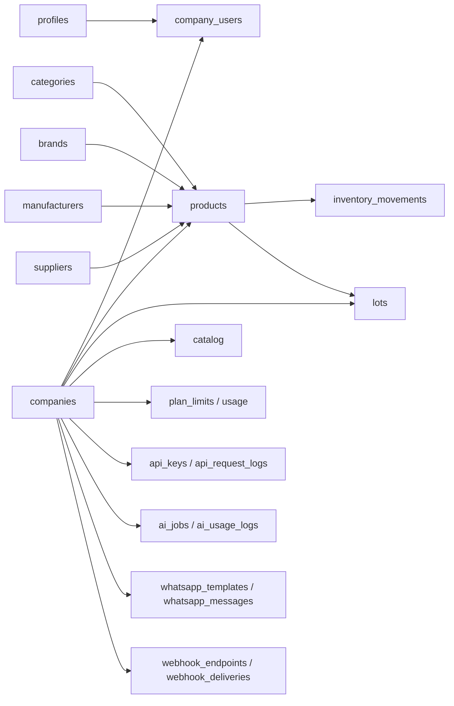

# MarketFlow — Modelo de Dados

> Language: pt-BR | [English](../../en/architecture/data-model.md)
>
> Status: DRAFT
>
> Documentation Standard v1.0

Fonte: [`sdd/02-DATABASE.md`](../../../sdd/02-DATABASE.md), entidades em [`sdd/10-FULL-SYSTEM.md`](../../../sdd/10-FULL-SYSTEM.md) e schemas em [`sdd/12-EXTRAS.md`](../../../sdd/12-EXTRAS.md).

## Purpose

O que o leitor aprende: esquema lógico do MarketFlow, entidades centrais, isolamento multi-tenant e preocupações transversais de dados. Visão lógica — não catálogo completo de colunas. **Implementação:** `supabase/migrations/` define 19 tabelas (RLS habilitado); várias tabelas dos SDDs ainda não foram criadas.

## Schemas / namespaces

| Schema / store | Purpose | Owner | Classification |
| --- | --- | --- | --- |
| `public` (PostgreSQL) | Dados de produto, catálogo, API, IA e WhatsApp | marketflow-team | Implementado (parcial) |
| Supabase Auth (schema `auth`) | Identidade/usuários | Supabase (managed) | Confirmed (SDD) |
| Supabase Storage (`storage.objects`) | Imagens/logos com metadados de tenant | Supabase (managed) | Confirmed (SDD) |

## Core entities

| Entity | Store | Responsibility | Classification |
| --- | --- | --- | --- |
| `profiles` | PostgreSQL | Perfil do usuário (dados de identidade fora do Auth) | Implementado |
| `companies` | PostgreSQL | Tenant principal; nome, CNPJ, slug único, status | Implementado |
| `users` | Supabase Auth (identidade) | Credenciais de login (sem papéis de negócio) | Confirmed (SDD) |
| `company_users` | PostgreSQL | Vínculo usuário–empresa; `role` (`GLOBAL_ADMIN`/`ADMIN`/`STOCK`/`VISITOR`) | Implementado |
| `categories` | PostgreSQL | Organização de produtos; hierarquia opcional | Implementado |
| `brands` | PostgreSQL | Marcas | Implementado |
| `manufacturers` | PostgreSQL | Fabricantes | Implementado |
| `suppliers` | PostgreSQL | Fornecedores | Implementado |
| `products` | PostgreSQL | Produtos (SKU/barcode único por empresa, unidade, preços, mínimo/máximo, imagens, visibilidade) | Implementado |
| `inventory_items` | PostgreSQL | Estado de estoque por produto (escopo empresa) | Implementado |
| `lots` | PostgreSQL | Lotes e validade; quantidade inicial/atual, custo, status de validade | Implementado |
| `inventory_movements` | PostgreSQL | Movimentações imutáveis de estoque (entrada, saída, ajuste, perda, inventário); histórico | Implementado |
| `api_keys` | PostgreSQL | API Keys (apenas `secret_hash`), empresa, scopes, ambiente, status, expiração | Implementado |
| `api_request_logs` | PostgreSQL | Auditoria por request (token, scope, status, rota, latência) | Implementado |
| `ai_jobs` | PostgreSQL | Jobs assíncronos de IA (status, provider, modelo, resultado/confiança) | Implementado |
| `ai_usage_logs` | PostgreSQL | Uso/custo de IA por empresa (tokens, custo estimado) | Implementado |
| `whatsapp_templates` | PostgreSQL | Templates de mensagens por empresa/idioma (PT-BR/EN/ES) | Implementado |
| `whatsapp_messages` | PostgreSQL | Histórico de mensagens com status e retry | Implementado |
| `webhook_endpoints` | PostgreSQL | Config de webhooks outbound (URL, secret, eventos, status) | Implementado |
| `webhook_deliveries` | PostgreSQL | Tentativas de entrega (status, retries, resposta/assinatura) | Implementado |
| `catalog_requests` | PostgreSQL | Solicitações de contato/pedido do catálogo | Não criada (apenas ref. FK) |
| `catalog_*` | PostgreSQL | Configuração do catálogo (vitrine por slug) | Não criada |
| `plan_limits` / `usage` | PostgreSQL | Limites de plano e uso por empresa (billing/entitlements) | Não criada |
| `notifications` | PostgreSQL | Notificações in-app | Não criada |

Total: **19 tabelas implementadas** em `20260905000000_initial_schema.sql` (11) + `20260905000002_api_ai_whatsapp_schema.sql` (8). Seed em `20260905000001_seed_global_admin.sql`.

## Relationships (high level)

## Isolamento multi-tenant

- **Estratégia:** banco PostgreSQL compartilhado com isolamento lógico.
- **Coluna obrigatória:** `company_id UUID NOT NULL` em todas as tabelas empresariais (`products`, `categories`, `brands`, `manufacturers`, `suppliers`, movimentações, lotes, `api_keys`, `ai_*`, `whatsapp_*`, `webhook_*` etc.).
- **RLS:** habilitado nas 19 tabelas implementadas. **Lacuna atual:** apenas 6 políticas definidas (`companies`, `products` ×2, `api_keys`, `whatsapp_templates`, `whatsapp_messages`) — as demais negam por padrão até que políticas sejam adicionadas.
- **Chaves primárias:** `UUID` via `gen_random_uuid()`; sem IDs sequenciais expostos publicamente.
- **Slug,** SKU/barcode, category hierarchy: unicidade validada **por empresa**.

## Cross-cutting data concerns

| Concern | Approach | Classification |
| --- | --- | --- |
| Multi-tenancy / isolation | `company_id UUID NOT NULL` + RLS em todas as tabelas empresariais | Implementado (políticas parciais) |
| Tratamento de secrets | `api_keys` armazena apenas `secret_hash`; chave completa exibida uma única vez | Implementado |
| Soft delete / archive | Exclusão lógica quando apropriado (ex.: categorias); movimentações **nunca** apagadas | Proposed |
| PII / retention | LGPD: fluxos de consentimento e retenção a documentar; mínimo necessário | Proposed |
| Encryption at rest (app-level) | Supabase/managed; sem criptografia custom no MVP | Inferred |

## Regras de integridade (resumo dos SDDs)

- Deduplicação de SKU/barcode **por empresa**; preços não podem ser negativos.
- Produto e estoque são conceitos separados; movimentações transacionais e imutáveis; correções geram ajustes.
- Lotes: produto vencido ≠ estoque disponível normal.
- Catálogo público: somente produtos ativos e publicados; **nunca** expor `cost_price`, margem, fornecedor, usuários ou auditoria.
- API Keys: prefixos de token `mf_live_`/`mf_test_`; segredo não armazenado em texto puro; scopes aplicados em todo request.
- Templates WhatsApp: placeholders validados; placeholders desconhecidos bloqueados antes de salvar; fallback de idioma.
- Free plan inicial: até 3 empresas por usuário, 100 produtos/empresa, 3 usuários/empresa (ver [ADR-006](../decisions/adr-006-monetization-free-first.md)).

## Related

- Architecture overview: [overview.md](overview.md)
- Contracts que expõem estas entidades: [contracts/api.md](../contracts/api.md)
- Segurança (RLS, Storage, proteção de dados): [security/security.md](../security/security.md)
- Dados sensíveis: [security/authorization.md](../security/authorization.md)
- Fonte dos schemas: `supabase/migrations/` (implementação) e `sdd/12-EXTRAS.md` (spec)