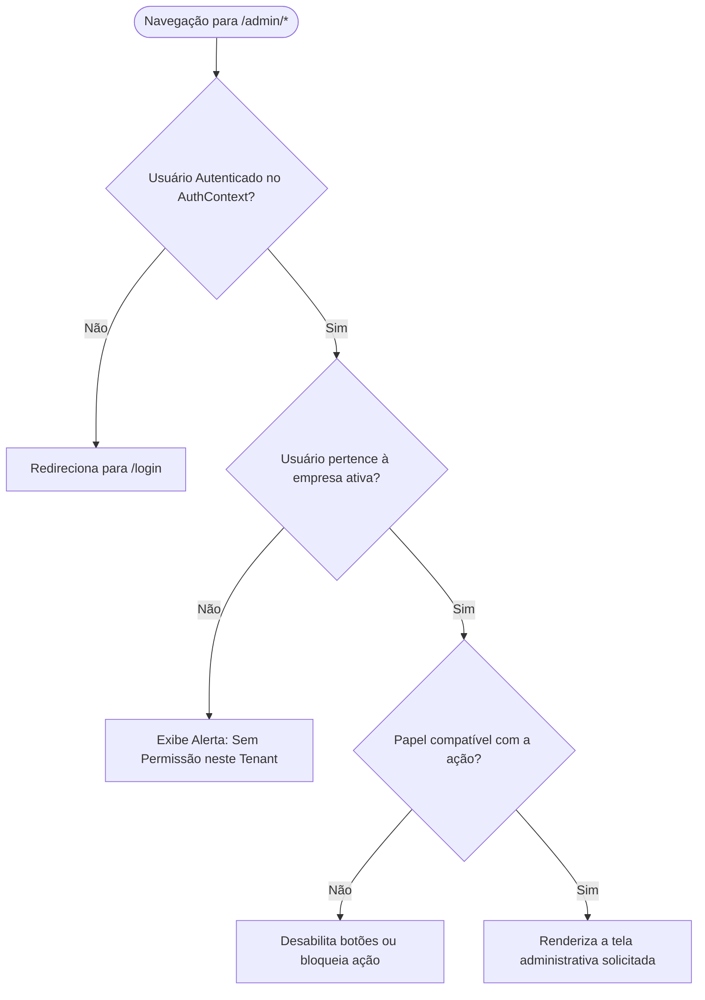

# 🛡️ Autenticação, IAM e Isolamento de Tenants

## 1. Objetivo
Especificar a arquitetura de segurança, gestão de identidades (IAM), controle de acesso baseado em papéis (RBAC) e o isolamento multi-inquilino (Multi-Tenancy) do **Olivelas MarketFlow**.

---

## 2. Visão Geral
O MarketFlow emprega autenticação oficial do **Supabase Auth** complementada por políticas de **Row Level Security (RLS)** no PostgreSQL. A aplicação assegura que:
1. Operadores de uma loja jamais visualizem ou modifiquem dados de outra loja.
2. Visitantes públicos do catálogo possam consultar produtos ativos e criar solicitações sem login.
3. Operações críticas (exclusão de empresas, manipulação de usuários) sejam restritas a administradores.

---

## 3. Responsabilidades do Módulo
- Gerenciar o ciclo de vida da sessão do usuário com tokens JWT armazenados com segurança.
- Mapear permissões utilizando o tipo enumerado `app_role` no banco de dados.
- Interceptar rotas da área administrativa (`/admin/*`) redirecionando usuários não autenticados para o formulário de login.
- Sincronizar perfis de usuário entre `auth.users` e a tabela `profiles`.

---

## 4. Matriz de Papéis de Acesso (RBAC)

| Papel (`app_role`) | Descrição | Permissões no Sistema |
| :--- | :--- | :--- |
| **`global_admin`** | Superusuário da Plataforma | Acesso irrestrito a todas as empresas, configurações globais e logs de IA. |
| **`admin`** | Gestor da Loja / Tenant | Gestão de produtos, colaboradores da empresa, configurações de catálogo e API keys. |
| **`stock`** | Operador de Estoque | Visualização e registro de entradas/saídas de inventário e lotes de produtos. |
| **`visitor`** | Cliente / Visitante | Visualização de lojas e produtos ativos; montagem e envio de pedidos. |

---

## 5. Fluxo Interno: Validação de Acesso a Rotas Administrativas



---

## 6. Relação com Outros Módulos
- **[Visão Geral da Arquitetura](../architecture/01-visao-geral.md):** Fornece o `AuthContext` que engloba as rotas do `App.tsx`.
- **[Modelo Relacional de Dados](../architecture/02-modelo-de-dados.md):** Define as tabelas `profiles`, `company_users` e as políticas RLS.
- **[In-Browser API Gateway](../integrations/01-api-gateway.md):** Utiliza conceitos análogos de escopos (`scopes`) para chaves programáticas.

---

## 7. Exemplos Práticos

### Política RLS de Isolamento por Tenant
```sql
CREATE POLICY "Company members full access to company" 
ON public.companies FOR ALL TO authenticated 
USING (
  id IN (SELECT company_id FROM public.company_users WHERE user_id = auth.uid()) OR
  created_by = auth.uid()
);
```

---

## 8. Referências para Outros Documentos
- [Visão Geral da Arquitetura](../architecture/01-visao-geral.md)
- [Modelo Relacional de Dados](../architecture/02-modelo-de-dados.md)
- [In-Browser API Gateway](../integrations/01-api-gateway.md)
